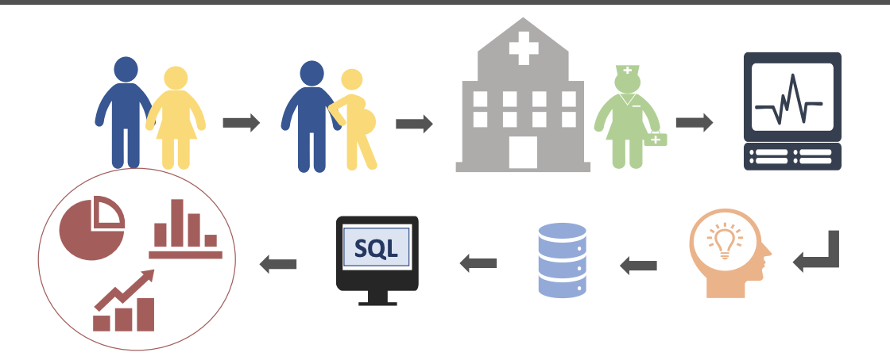
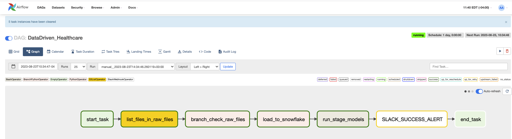

<!-- ABOUT THE PROJECT -->

$${\color{red}Still \space working \space on \space project}$$

## <center>$${\color{blue}Overcoming \space EMR \space Challenges \space with \space Cloud-Based \space Solutions:}$$</center>
<br>
<br>

#### <font color="blue"><em><center>Harnessing Cloud Technology for an Efficient Data Warehouse Solution</em></center></font>
I worked for a health company that encountered a major issue with their EMR system because it did not align with their business process. In turn, this caused the system to be buggy, as too many custom builds were implemented. The company decided to move away from their current system and instead implemented eClinicalWorks. The EMR company owned the database, so my company had to arrange an amendment to the contract that enables them to extend their usage agreement. The EMR company also agreed to FTP the live data files before work begins at 2:00 am and after work ends at 7:00 pm.
<br><br>
My job was to design and implement a data warehouse from these files. The requirements included creating various production reports and KPI’s that matched with the EMR system. The business owners would compare eClinicalWorks integrated reports with my reports and if aligned, they would be flagged to be used for production. In the company’s view, this was critical for data migration because it guaranteed that all operational reports would be correct and more importantly, would prove that eClinicalWorks was configured based on the company’s business requirements.
<br><br>
My intention with this project is to replicate some of the more important aspects of the above scenario. Please note that the healthcare dataset is fake and is being used only for demonstration purposes.

---------------------------------------------------------------------------------------------------------------------
#### Agenda test

- Cloud-Based Solutions: Healthcare Data Warehouse
  - Configuration Approach
    - Jupyter Lab: Set up Jupyter Lab like a troubleshoot tool
    - Airflow: Manages ETL workflows.
    - AWS S3: Acts as data storage.
    - Snowflake: Our cloud data warehouse.
    - Others: Includes AWS Systems Manager Parameter Store, DBT for data transformations, and Slack for process notifications.
  - Ingestion Approach
    - Explore Dataframe: Using Python to explore data. Load it as a CSV file to S3 buckets.
    - AWS S3: Organize data with efficient folder structures, naming conventions, bucket policies, and Slack notifications.
  - Orchestration Approach
    - Apache Airflow: Design workflows, handle errors, log and monitor DAG runs, integrate with Snowflake, and set alerts via Slack.
    - Transformation & Modeling Approach
    - dbt: Transform raw data, ensure data quality, automate transformations, and ensure data integrity in Snowflake. Slack notifications included.
  - Reporting Approach
    - Tableau: Setup, connectivity to Snowflake, and dashboard design.


## Cloud Technology Project

A comprehensive guide on setting up a data pipeline leveraging key cloud technologies: 
[Apache Airflow](https://airflow.apache.org/), [Slack](https://slack.com/), [AWS S3](https://aws.amazon.com/), [Snowflake](https://www.snowflake.com/en/), and [DBT](https://www.getdbt.com/).

---


### Configuration Approach

The Configuration Approach ensures that all data pipeline components are appropriately set up.

#### Components:

- **Airflow**: Manages ETL workflows.
- **AWS S3**: Acts as data storage.
- **AWS Systems Manager Parameter Store**: Secures configurations.
- **Snowflake**: Our cloud data warehouse.
- **DBT**: Handles data transformations.
- **Slack**: Delivers process notifications.


---

### 1. Dockerized Airflow Setup

<details>
<summary>Click to Expand</summary>

#### 1. Introduction:

- **Overview**: Dockerized Airflow with PostgreSQL backend, aiming for scalability and modularity.

#### 2. Prerequisites:

- Docker & Docker Compose
- Ample storage and RAM

#### 3. File Structure:

-- **data_eng**: My primary configuration directory for your data engineering tasks.
  - `docker-compose.yml`: Orchestrates the services using Docker Compose.
  - `mnt/airflow/airflow.cfg`: Airflow's configuration file.
- **docker/airflow**:
  - `Dockerfile`: Steps to build the Airflow image.
  - `start-airflow.sh`: A bash script initializing and launching Airflow services.
- **docker/postgres**:
  - `Dockerfile`: Instructions to generate the PostgreSQL image.
  - `init-postgres-db.sh`: Sets up the PostgreSQL database.
------

#### 4. **Documentation for Individual Components**:

##### 4.1 **Airflow Dockerfile (`docker/airflow/Dockerfile`)**:
This Dockerfile provides the blueprint to create a Docker image for Airflow. It begins with a base image of Python 3.8, installs necessary system packages and Python libraries, and sets up the environment for Airflow.

##### 4.2 **start-airflow.sh Script (`docker/airflow/start-airflow.sh`)**:
This script automates multiple steps:
- Navigates to the AIRFLOW_HOME directory.
- Exports environment variables, including deactivating the loading of example DAGs.
- Initializes the metadata database.
- Creates a default user for the Airflow web UI.
- Launches the Airflow scheduler and web server.

##### 4.3 **PostgreSQL Dockerfile (`docker/postgres/Dockerfile`)**:
Using the PostgreSQL base image (version 15.3 based on Alpine), this Dockerfile prepares a PostgreSQL instance tailored for integration with Airflow. It also includes a script (`init-postgres-db.sh`) to initialize the PostgreSQL database.

##### 4.4 **init-postgres.sh Script (`docker/postgres/init-postgres.sh`)**:
This script sets up the environment within the PostgreSQL container. It performs the following:
- Drops the existing database and role if they exist.
- Creates a new user and database.
- Grants privileges to the new user.

#### 5. **Setting Up Airflow with Docker**:
- **Docker Compose File (`docker-compose.yml`)**:
  - **Version**: Docker Compose version (2.1).
  - **Airflow Service**: Details pertaining to the Airflow service's Docker configuration.
  - **Volumes**: Configuration files and other necessary directories mounted inside the container.
  - **Ports**: Port mapping details.
  - **Healthcheck**: Monitors the health of the Airflow service.

#### 6. **Setting Up PostgreSQL with Docker**:
- **Docker Compose File (`docker-compose.yml`)**:
  - **Version**: Docker Compose version (2.1).
  - **PostgreSQL Service**: Information about the Docker configuration for the PostgreSQL service.
  - **Ports**: Port mapping details.
  - **Environment Variables**: Default credentials and database specifications.
  - **Healthcheck**: Ensures PostgreSQL's health using `pg_isready`.


#### 7. Execution:

- **Change Directory where airflow is located**: `cd data_eng/`

   - **Start.sh**:Build the base images from which are based the Dockerfiles (hen Startup all the containers at once )
     ```shell
      docker-compose up -d --build
     ```

   - **Stop.sh**: Stop all the containers at once
     ```shell
      docker-compose down
     ```

   - **Restart.sh**:
     ```shell
     ./stop.sh
     ./start.sh
     ```

   - **reset.sh**:
     ```shell
      docker-compose down
      docker system prune -f
      docker volume prune -f
      docker network prune -f
      rm -rf ./mnt/postgres/*
      docker rmi -f $(docker images -a -q)
     ```
</details>


### 2. AWS Environment Setup

<details>
<summary>Click to Expand</summary>

#### 1. Basic Environment Configuration:

   - **S3 Bucket**: 
     ```shell
     aws s3api create-bucket --bucket YOUR_BUCKET_NAME --region YOUR_REGION
     ```

   - **IAM User 'testjay'**:
     ```shell
     aws iam create-user --user-name testjay
     ```

   - **S3 Bucket Policy**:
     ```shell
     aws iam list-policies
     aws iam attach-user-policy --user-name jay --policy-arn YOUR_BUCKET_POLICY_ARN
     ```

   - **IAM Role 'developer'**:
     ```shell
     aws iam create-role --role-name developer --assume-role-policy-document '{"Version": "2012-10-17","Statement": [{"Effect": "Allow","Principal": {"Service": "ec2.amazonaws.com"},"Action": "sts:AssumeRole"}]}'
     ```

   - **SSM Policy for Role**:
     ```shell
     aws iam list-policies
     aws iam attach-role-policy --role-name developer --policy-arn YOUR_SSM_POLICY_ARN
     ```

   - **Associate Role to User**:
     ```shell
     aws iam put-user-policy --user-name jay --policy-name AssumeDeveloperRole --policy-document '{"Version": "2012-10-17","Statement": [{"Effect": "Allow","Action": "sts:AssumeRole","Resource": "arn:aws:iam::YOUR-AWS-ACCOUNT-ID:role/developer"}]}'
     ```

#### 2. EMR Full Access for S3:

   - **Bucket Policy**:
     ```json
     {
        "Version": "2012-10-17",
        "Statement": [
            {
                "Effect": "Allow",
                "Principal": {
                    "Service": "elasticmapreduce.amazonaws.com"
                },
                "Action": "s3:*",
                "Resource": "arn:aws:s3:::YOUR_BUCKET_NAME/*"
            }
        ]
     }
     ```

   - **Apply Policy**:
     ```shell
     aws s3api put-bucket-policy --bucket YOUR_BUCKET_NAME --policy file://path/to/your/emr-policy.json
     ```

#### 3. AWS Systems Manager Parameter Store:

   - **Parameter Setup**:
     ```shell
     aws ssm put-parameter --name "SnowflakeUsername" --type "String" --value "YourUsername"
     aws ssm put-parameter --name "SnowflakePassword" --type "SecureString" --value "YourPassword"
     aws ssm put-parameter --name "SnowflakeAccount" --type "String" --value "YourAccount"
     aws ssm put-parameter --name "SnowflakeRole" --type "String" --value "YourRole"
     ```

</details>

---

### 3. Snowflake Setup

<details>
<summary>Click to Expand</summary>

#### 1. Starting with Snowflake:

   - Snowflake offers a cloud-native data platform.
      - [Register on Snowflake](https://www.snowflake.com/)
      - Choose 'Start for Free' or 'Get Started'.
      - Complete the registration.
      - Use credentials to access Snowflake's UI.

#### 2. Structure Configuration:

   - **Data Warehouse**:
     ```sql
     CREATE WAREHOUSE IF NOT EXISTS my_warehouse 
        WITH WAREHOUSE_SIZE = 'XSMALL' 
        AUTO_SUSPEND = 60 
        AUTO_RESUME = TRUE 
        INITIALLY_SUSPENDED = TRUE;
     ```

   - **Database**:
     ```sql
     CREATE DATABASE IF NOT EXISTS my_database;
     ```

   - **Roles and Users**:
     ```sql
     -- Role Creation
     CREATE ROLE IF NOT EXISTS my_role;
     
     -- User Creation
     CREATE USER IF NOT EXISTS jay 
        PASSWORD = '<YourSecurePassword>' 
        DEFAULT_ROLE = my_role
        MUST_CHANGE_PASSWORD = FALSE;
     ```

#### 3. Organize Data:

   - **Schemas**:
     ```sql
     USE DATABASE my_database;
     CREATE SCHEMA IF NOT EXISTS chart;
     CREATE SCHEMA IF NOT EXISTS register;
     CREATE SCHEMA IF NOT EXISTS billing;
     ```

   - **Tables**:
     ```sql
     -- Chart Schema
     CREATE TABLE IF NOT EXISTS chart.code (
        id INT AUTOINCREMENT PRIMARY KEY
     );

     -- Register Schema
     CREATE TABLE IF NOT EXISTS register.users (
        id INT AUTOINCREMENT PRIMARY KEY,
        name STRING,
        email STRING UNIQUE
     );
     ```

#### 4. Permissions:

   - **Assign Roles and Grant Privileges**:
     ```sql
     GRANT ROLE my_role TO USER jay;
     GRANT USAGE ON DATABASE my_database TO ROLE my_role;
     GRANT USAGE ON WAREHOUSE my_warehouse TO ROLE my_role;
     GRANT USAGE ON SCHEMA chart TO ROLE my_role;
     GRANT SELECT, INSERT, UPDATE, DELETE ON ALL TABLES IN SCHEMA chart TO ROLE my_role;
     ```

**Note**: Replace placeholders (like `<YourSecurePassword>`) with actual values.

</details>

### 4. DBT (Data Build Tool) Setup


<details>
<summary>Click to Expand</summary>

**Note**: DBT (Data Build Tool) provides a means to transform data inside your data warehouse. With it, analytics and data teams can produce reliable and structured data sets for analytics.

   - **Installation**: To get started with DBT, you first need to install it 

     ```shell
      pip install dbt
     ```

   - **Initialize a New DBT Project**: Navigate to your directory of choice and initiate a new project

     ```shell
     dbt init your_project_name
     ```

   - ** Configuration**: Modify the ~/.dbt/profiles.yml to set up your Snowflake connection. This file will contain details such as account name, user, password, role, database, and warehouse.
     ```shell
        your_project_name:
      target: dev
      outputs:
        dev:
          type: snowflake
          account: your_account
          user: your_username
          password: your_password
          role: your_role
          database: your_database
          warehouse: your_warehouse
          schema: your_schema
          threads: [desired_number_of_threads]
     ```
     - **Running and Testing:

     ```shell
     dbt debug
     ```
</details>

---
## Ingestion Approach

Our Ingestion Approach is designed to ensure that all data pipeline components are appropriately set up and functioning as intended.

---

### Components:

- **Explore Dataframe**: Investigate data using Python scripts.
- **File Process**: Load dataframes as CSV files to S3 buckets.
- **Folder Management**: Creation of folders for errors and processed files.

---

### 1. Setup DataFrame Exploring

<details>
<summary>Click to Expand</summary>

#### a. Data Exploring Code Setup:

- **Overview**: I utilized Jupyter Lab as my primary exploration tool.

- **Explore_Files.ipynb**:

    ```python
    import pandas as pd
    import matplotlib.pyplot as plt
    from tabulate import tabulate
    import io

    def explore_csv(filename):
        # Read the CSV file
        df = pd.read_csv(filename)
        
        # Display the shape of the dataframe
        print(f"Shape of the dataframe: {df.shape} (rows, columns)\n")
        
        # Display the first 5 rows of the dataframe
        print("Head of the dataframe:")
        print(tabulate(df.head(), headers='keys', tablefmt='grid'))
        
        # Display concise summary of the dataframe
        buffer = io.StringIO()
        df.info(buf=buffer)
        s = buffer.getvalue()
        print("\nDataframe Info:")
        print(s)
        
        # Display basic statistics
        print("\nBasic statistics:")
        print(tabulate(df.describe(include='all'), headers='keys', tablefmt='grid'))
        
        # Display null values per column
        print("\nNull values per column:")
        print(tabulate(pd.DataFrame(df.isnull().sum(), columns=['Null Count']), headers='keys', tablefmt='grid'))
        
        # Display number of unique values per column
        print("\nNumber of unique values per column:")
        print(tabulate(pd.DataFrame(df.nunique(), columns=['Unique Count']), headers='keys', tablefmt='grid'))
        
        # Plot histograms for numeric columns
        df.hist(figsize=(15, 10))
        plt.tight_layout()
        plt.show()

    # Example
    filename = 'code.csv'
    explore_csv(filename)

    ```

    **Best Practice Recommendations**:
      - **Data Cleansing**: Ensure data consistency across records.
      - **Missing Data Handling**: Address nulls or gaps in data.
      - **Logging**: Implement logging for transparency and easier debugging.
      - **Routine Automation**: Consider tools or triggers for script execution scheduling.

#### b. File Processing Code Setup:

- **Overview**: Jupyter Lab was used for this step as well.

- **Process_Files.ipynb**:

    ```python
    import pandas as pd
    from datetime import datetime
    import boto3
    from io import StringIO
    import logging

    # Setup logging
    logging.basicConfig(level=logging.INFO)

    # Get AWS credentials from environment variables
    aws_access_key_id = os.environ.get('AWS_ACCESS_KEY_ID')
    aws_secret_access_key = os.environ.get('AWS_SECRET_ACCESS_KEY')

    session = boto3.Session(
        aws_access_key_id=aws_access_key_id,
        aws_secret_access_key=aws_secret_access_key,
        region_name='us-east-1'  # Change this to your AWS region
    )

    s3 = session.resource('s3')
    bucket_name = 'snowflake-emr'  # Name of your bucket
    s3_folder = 'raw_files/'

    def process_dataframe(df, row_limit, filename):
        num_files = (len(df) + row_limit - 1) // row_limit

        for i in range(num_files):
            start_index = i * row_limit
            end_index = start_index + row_limit
            df_subset = df.iloc[start_index:end_index]
            
            try:
                csv_buffer = StringIO()
                df_subset.to_csv(csv_buffer, index=False)
                timestamp_str = datetime.now().strftime('%Y%m%d%H%M%S')
                s3_file_path = s3_folder + f"{filename}_{timestamp_str}-{i+1}.csv"
                s3.Object(bucket_name, s3_file_path).put(Body=csv_buffer.getvalue())
                logging.info(f"Processed DataFrame (Part {i+1}) saved to s3://{bucket_name}/{s3_file_path}")
            except Exception as e:
                logging.error(f"Error while processing DataFrame part {i+1}: {str(e)}")

    # Example usage:
    row_limit = 7000
    filename = 'users'
    input_df = users  # Assume you've loaded users dataframe before this
    process_dataframe(input_df.copy(), row_limit, filename)

    ```

    **Best Practice Recommendations**:
      - **Error Handling**: Incorporate try-except blocks for robust error handling.
      - **Logging**: Utilize Python's logging library over simple print statements.
      - **Parameterization**: Make the script versatile to handle any DataFrame and path.
      - **Efficient Data Handling**: Stream data in chunks instead of splitting the dataframe in-memory.

</details>

---

### 2. AWS S3 Code Structure

<details>
<summary>Click to Expand</summary>

#### a. S3 Folder Structure:

- Command to list S3 folders: `aws s3 ls s3://snowflake-emr`

   Folders in S3:
   
    ```shell
    PRE error_files/
    PRE processed/
    PRE raw_files/
    ```

### b. Naming Conventions:

- Timestamps are used for file naming:

    ```python
    timestamp_str = datetime.now().strftime('%Y%m%d%H%M%S')
    ```

#### c. Slack Notifications:

- Slack webhook integration for notifications on success or failure: **lease ensure you've taken care of the security considerations (like not hardcoding AWS access keys or Slack Webhook URLs) when using these scripts in a real-world scenario. Use environment variables or secrets management tools instead**

    ```python
    SLACK_WEBHOOK_URL = 'https://hooks.slack.com/services/XXXXXXXXX/XXXXXXXXX/XXXXXXXXXXXXXX'  # Replace with your webhook URL

    def send_slack_message(message):
        #... [rest of the code]
    ```

</details>

----

## Orchestration Approach

The Orchestration Approach ensures that all data pipeline components are appropriately set up.

<br>
<br>

#### Dags process:

- Design DAGs for different workflows – `data ingestion`, `transformation`, and `reporting`.
  - Best practise: Have different Dags for each work flow. `I created one Dag for this project`
  - Set up troubleshooting script:
    - Create `Test Script` before creating your Dags, this ave troubleshooting time: `list A few`
      - **Test python version** `_00_python_version_dag.py`: 
      - **Validate path S3-bucket** `_04_s3_path.py`                   
      - **Connect to Snowflake and validate Snowflake version** `_01_snowflake_connect_connect.py`        
      - **Validate AWS Service Manager Parameter**`_02_snowflake-connector_.py`                           
      - **Validate Create Table in Snowflake**`_03_create_tables_snowflake.py`                   
    - Set up error handling mechanisms in Airflow to handle failures or inconsistencies.
      - ** Error Handling: try and except**
          ```python
          # Copy the file to the new location
          try:
              print(f"Copying from {source_bucket}/{source_key} to {destination_bucket}/{destination_key}")  # Logging
              s3.copy_object(Bucket=destination_bucket, CopySource={'Bucket': source_bucket, 'Key': source_key}, Key=destination_key)
          except Exception as e:
              print(f"Error copying object: {e}")
              return  # Exit the function if copying fails
          ```
  - Implement logging and monitoring to keep track of DAG runs:`Did not implement however used slack for alert`
  - Implement retries and alert mechanisms in case of DAG failures:`Did not implement however used slack for alert`
  - Ensure there's a solid connection setup between Airflow and Snowflake.
    - `docker-compose.yml`:Ensure that your local devlopment matches the airflow(AWS,DBT):`opt/airflow`
    ```python
        airflow:
          build: ./docker/airflow
          restart: always
          container_name: airflow
          volumes:
            - ./mnt/airflow/airflow.cfg:/opt/airflow/airflow.cfg
            - ./mnt/airflow/dags:/opt/airflow/dags
            - ~/.aws:/opt/airflow/.aws
            - /home/yourpath/.dbt:/opt/airflow/.dbt
            - /home/yourpath/projects/repo/DataDrivenHealthcare:/app
    ```
  - **Dag has a list of Task**:`DataDriven_Healthcare:`
      - **start_task**:`Airflow.operators.dummy_operator:Its like placeholder can be use to start task`:This module is deprecated. Please use `airflow.operators.empty`
          ```python
              start_task = DummyOperator(task_id='start_task')
          ```
      - **list_files_in_raw_files**:
          ```python
              s3_list = S3ListOperator(
              task_id='list_files_in_raw_files',
              bucket='snowflake-emr',
              prefix='raw_files/',
              aws_conn_id='aws_default'
              )
          ```
      - **branch_check_raw_files**: When the `BranchPythonOperator` is executed, it will run the provided Python callable. The callable should return the task_id of the next task to run. After the `BranchPythonOperator` task completes, the task with the task_id returned by the Python callable will be executed, while all other downstream tasks are skipped.
          ```python
                branch = BranchPythonOperator(
                task_id='branch_check_raw_files',
                python_callable=branch_based_on_files_existence,
                provide_context=True,
                op_args=[],
                op_kwargs={'bucket_name': 'snowflake-emr', 'prefix': 'raw_files/'})
          ```
      - **load_to_snowflake**: `from airflow.operators.python_operator import PythonOperator`:The PythonOperator is a specific type of operator used to execute a Python callable (a function) within a DAG
          ```python
                start_task = DummyOperator(task_id='start_task')
          ```
      - **run_stage_models**: The `S3ListOperator` is an operator in Apache Airflow that's used to get a list of keys from an S3 bucket.
          ```python
                run_stage_models = BashOperator(
                task_id='run_stage_models',
                bash_command='/app/Developer/dbt-env/bin/dbt run --model tag:"DIMENSION" --project-dir /app/Developer/dbt_health --profile dbt_health --target dev')
          ```
      - **slack_success_alert**: 
          ```python
                slack_success_alert=task_success_slack_alert(dag=dag)
          ```
      - **end_task**
          ```python
                end_task = DummyOperator(task_id='end_task')
          ```
