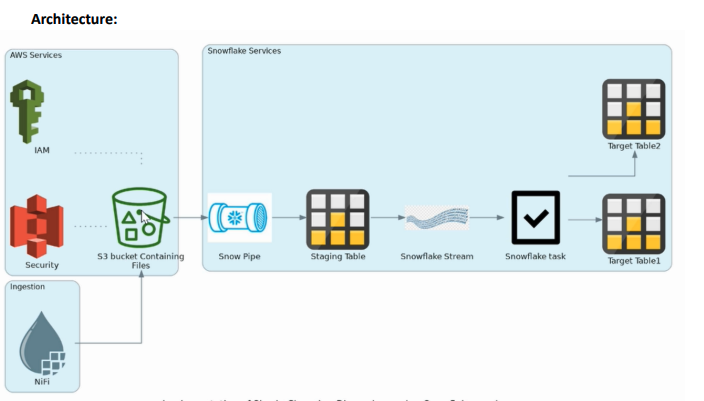
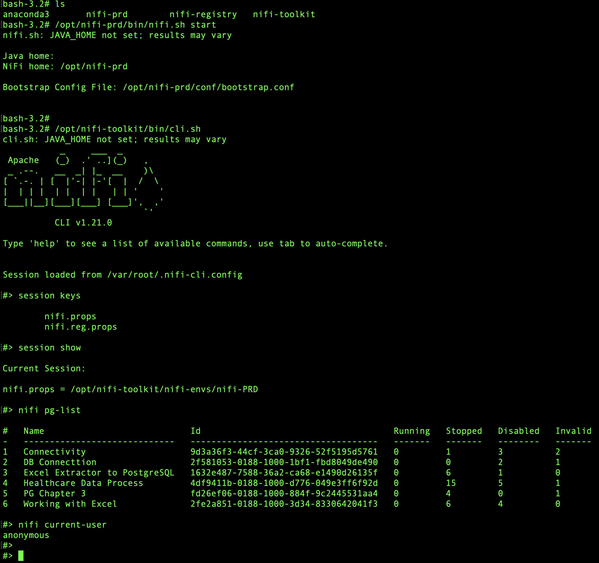
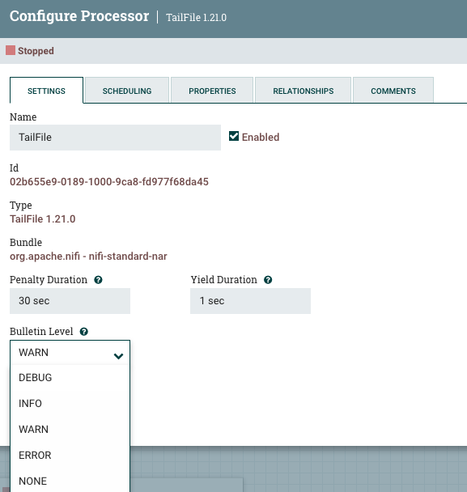
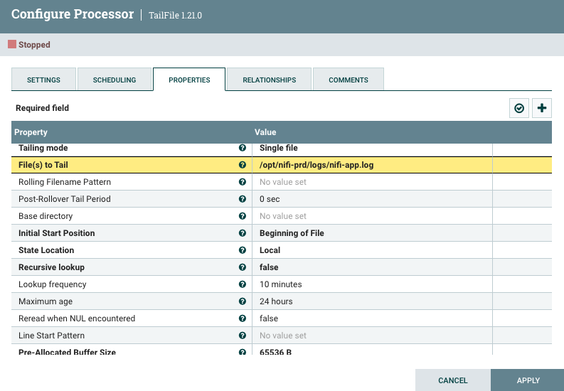
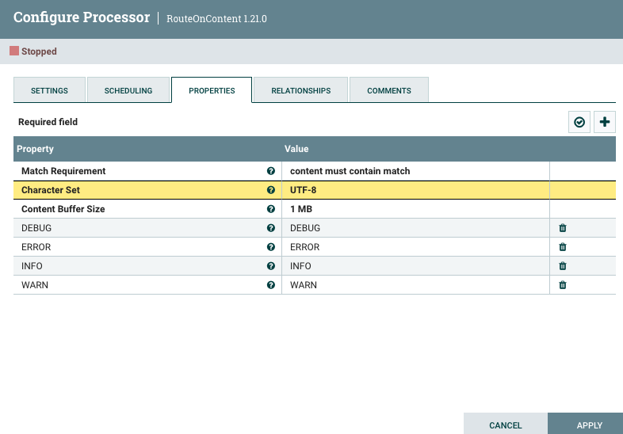
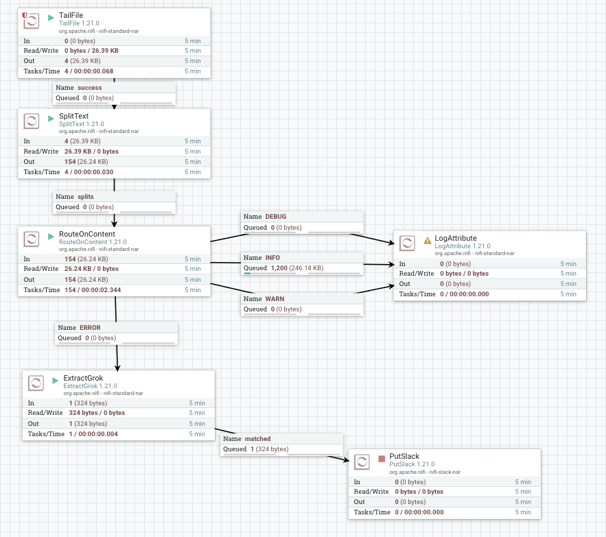
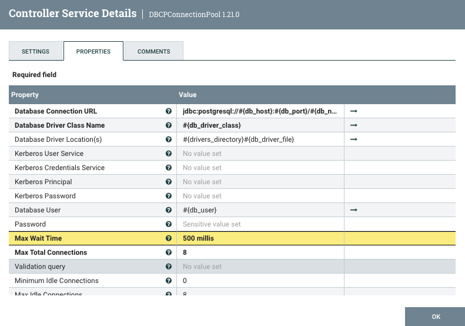
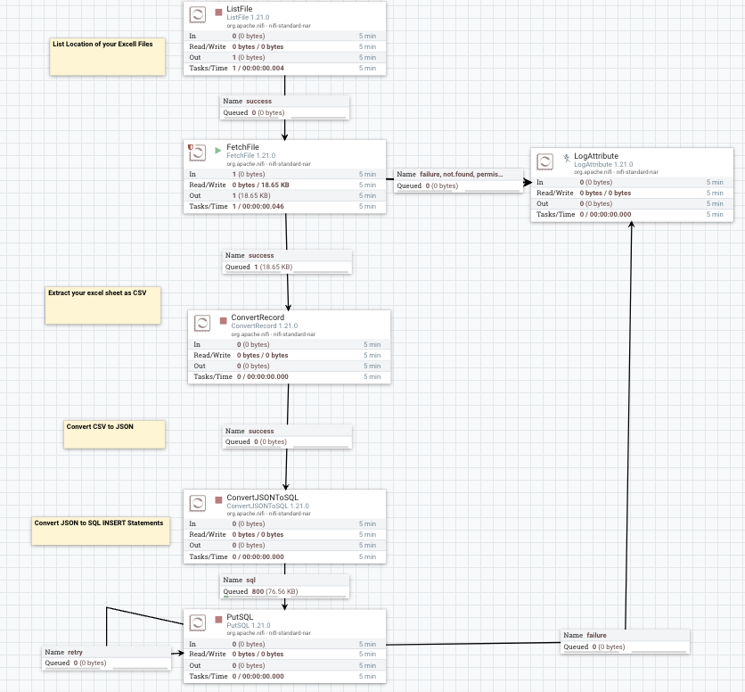

<!-- ABOUT THE PROJECT -->

$${\color{red}Still \space working \space on \space project}$$

## <center>$${\color{blue}Overcoming \space EMR \space Challenges \space with \space Cloud-Based \space Solutions:}$$</center>
<br>
<br>

#### <font color="blue"><em><center>Harnessing Cloud Technology for an Efficient Data Warehouse Solution</em></center></font>
I worked for a health company that encountered a major issue with their EMR system because it did not align with their business process. In turn, this caused the system to be buggy, as too many custom builds were implemented. The company decided to move away from their current system and instead implemented eClinicalWorks. The EMR company owned the database, so my company had to arrange an amendment to the contract that enables them to extend their usage agreement. The EMR company also agreed to FTP the live data files before work begins at 2:00 am and after work ends at 7:00 pm.
<br><br>
My job was to design and implement a data warehouse from these files. The requirements included creating various production reports and KPI’s that matched with the EMR system. The business owners would compare eClinicalWorks integrated reports with my reports and if aligned, they would be flagged to be used for production. In the company’s view, this was critical for data migration because it guaranteed that all operational reports would be correct and more importantly, would prove that eClinicalWorks was configured based on the company’s business requirements.
<br><br>
My intention with this project is to replicate some of the more important aspects of the above scenario. Please note that the healthcare dataset is fake and is being used only for demonstration purposes.


#### <font color="green"><left>PHASE ONE: Data Ingestion, Data Storage, Data Warehouse Layers</left></font>
---------------------------------------------------------------------------------------------------------------------

<details>
  <summary><strong><em>Ingestion Approach: Apache Nifi</em></strong></summary>

The Ingestion (Apache Nifi) is designed to automate data across systems. In real-time, it will load (PutFile) the files into a local database (Postgres) before pushing the files to the cloud storage (S3) environment.

#### Table of Content
- NIFI: Goto [http:/localhost:8443/nifi/](http:/localhost:8443/nifi/)
  - Setup Nifi Environment
    - Installing Nifi Toolkit & Nifi
  - Automate Log parsing:
    - INFO
    - DEBUG
    - WARN
    - ERROR
  - Staging Database (PostgreSQL):Ingest files into Database,temporary storage location for Data cleansing, validation and transformation processes
    - parameter-context
      - JSON FILE: Database configuration
    - postgresql
      - Create Tables
      - Upload Files
    - Cloud Storage (S3): Stored processed and transformation files
        - Parameter-Context
        - JSON FILE: File configuration
        - AWS(S3)
        - Identity and Access Management (IAM)
        - Access Keys
        - Bucket
        - Folder
        - Upload Files

<details>
<summary>
    
##### 1) Goto [http:/localhost:8443/nifi/](http:/localhost:8443/nifi/): Setup Nifi Environment
</summary>

- Setup Nifi Environment: `I am using a MAC`
  - Open Terminal
  - Move to the following folder: `cd /opt`
- Installing Nifi Toolkit: You can download the Apache Nifi [here](https://nifi.apache.org/download.html) or follow these steps:
  - Create the following variables:
    - `export version='1.22.0'`
    - `export nifi_registry_port='18443'` (I am keeping the illustration simple. However, install registry, prod, dev stg is recommended)
    - `export nifi_prd_port='8443'`
  - Download Nifi Toolkit: I am using a MAC and my environment location is `cd/opt`
    - `wget https://dlcdn.apache.org/nifi/${version}/nifi-toolkit-${version}-bin.zip cd /opt`
    - `unzip nifi-toolkit-${version}-bin.zip -d /opt/nifi-toolkit && cd /opt/nifi-toolkit/nifi-toolkit-${version} && mv * .. && cd .. && rm -rf nifi-toolkit-${version}`
  - Configuration Files
  
    Using the variables created above to configure Loop
    ----------------------------------------------------
    
    ```shell
    prop_replace () {
      target_file=${3:-${nifi_props_file}}
      echo 'replacing target file ' ${target_file}
      sed -i -e "s|^$1=.*$|$1=$2|" ${target_file}
    }

    mkdir -p /opt/nifi-toolkit/nifi-envs
    cp /opt/nifi-toolkit/conf/cli.properties.example /opt/nifi-toolkit/nifi-envs/nifi-PRD
    prop_replace baseUrl http://localhost:${nifi_prd_port} /opt/nifi-toolkit/nifi-envs/nifi-PRD
    cp /opt/nifi-toolkit/conf/cli.properties.example /opt/nifi-toolkit/nifi-envs/registry-PRD
    prop_replace baseUrl http://localhost:${nifi_registry_port} /opt/nifi-toolkit/nifi-envs/registry-PRD
    ```
    
    ### NIFI CLI STEPS:
    
    <strong>The config files have the following properties</strong>
    -----------------------------------------------------------------------------
    
    - Configure this nifi-PRD
      - Type the following: `cd /opt/nifi-toolkit/nifi-envs`
      - Add the following to `baseUrl`: `baseUrl=http://localhost:8443` 
    - Type the following and enter Nifi Toolkit env: `/opt/nifi-toolkit/bin/cli.sh`
    - Show Session Keys: `session keys`
    - Add session: `session set nifi.props /opt/nifi-toolkit/nifi-envs/nifi-DEV`

    <strong>View the nifi Environment</strong>
    ---------------------------------------------------------------
     
    - Start Nifi: `/opt/nifi-prd/bin/nifi.sh start` 
    - Start Nifi-toolkit: `/opt/nifi-toolkit/bin/cli.sh`                 `
    - View current Session: `session show`
    - Find the root PG Id: `nifi get-root-id`
    - List all Process Groups: `nifi pg-list` (its empty,but will be used in `Files to Postgres Database` section)
    - Find the current user: `nifi current-user`
    - List all available templates: `nifi list-templates` (its empty, haven't add any template as yet)

     <strong>Below is a basic view of Nifi Environment</strong>
    ---------------------------------------------------------------
     
    <br> 

</details>


<details>
<summary>
  
##### 2) Goto [http:/localhost:8443/nifi/](http:/localhost:8443/nifi/): Automate Log parsing
</summary>

<strong> Setup Log parsing inside NIFI</strong>
---------------------------------------------------------------

- Log file location: `/opt/nifi-prd/logs` we can view the log files `nifi-app.log`
- Start Nifi: `/opt/nifi-prd/bin/nifi.sh start` 
- Start Nifi-toolkit: `/opt/nifi-toolkit/bin/cli.sh`
- Goto your nifi web location: `http:/localhost:8443/nifi/`
    - Drag Process Group icon onto the plane and name it `Healthcare Data Process` then double click to open another plane
    - Drag another `Process Group` and name it `LOGS`

<strong> Create the Log Flow in Nifi</strong>
---------------------------------------------------------------

- Drag the `Processor` onto the plane and type `TailFile` and Relationship is success
- Open the TailFaile Configure page and click on the `SETTINGS` and click on `Bulletin Level`
    - Will mirror the flow base on the `Bulletin Level` Then click on `PROPERTIES`
    - In `Property` column  `Tailing mode` choose Value `Single file` and in column `File(s) to Tail` add the log path
    - ***Log file Path**: `/opt/nifi-prd/logs/nifi-app.log`<br><br>

    - TailFile Configure Processor: `Bulltin Level`
    ------------------------------------------
     <br>

    - TailFile Configure Processor: `PROPERTIES`
    ------------------------------------------
     <br>

    - Connect `TailFile` RELATIONSHIPS to Success `SplitText`
    - Configure Processor for `SplitText`: Line Split Count `1`this split the `Bulltin Level type`
        - ***Header Line Count***: `0`
        - ***Removing Trailing Newlines***: `True`
    - Connect `SplitText` RELATIONSHIPS to Success `RouteOnContent` and Terminate: `failure` and `original`
    - Configure Processor for `RouteOnContent`
        - ***Match Requirement***: `content must contain match`
        - ***Character Set***: `UTF`
        - ***Content Buffer Size*** : `1 MB`
        - ***Click*** the `+` and manually add the following:
            - DEBUG : connect to LongAttribute
            - ERROR : connect to `ExtractGrok`
            - INFO : connect to LongAttribute
            - WARN : connect to LongAttribute
            - See Below <br>
                -  <br>
    - Connect `RouteOnContent` RELATIONSHIPS to Success `ExtractGrok` and Terminate: `unmatched`
    - Configure Processor for `ExtractGrok`
        - ***Grok Expression***: `%{TIMESTAMP_ISO8601:timestamp} %{LOGLEVEL:level} \[%{DATA:thread}\] %{DATA:class} %{GREEDYDATA:message}`
        - ***Character Set***: `flowfile-attribute`

    - If you have a `Slack` account Connect `RouteOnContent` RELATIONSHIPS to Success `PutSlack`
    - Configure Processor for `RouteOnContent`
        - ***Webhook URL***: `Sensitive value set`
        - ***Webhook Text***: ` An Error occoured at ${grok.timestamp} with Service ${grok.thread}. Error msg ${grok.message}`
        - Channel: <Your slack Channel>

    NIFI: LOG DATA FLOW
    ------------------------------------------
     <br>   
            
 
</details>

  <details>
<summary>
  
 ##### 3) Goto [http:/localhost:8443/nifi/](http:/localhost:8443/nifi/): Push Files to PostgreSQL Database
</summary>
    
- Incorporating a staging database may seem like an unnecessary step since the files are already standardized. However, there are several benefits to consider. Firstly, it provides cost-effectiveness. Utilizing the cloud for repeated SELECT operations can be expensive. Secondly, the staging database allows for the identification of any unforeseen data issues and enables additional data cleansing and standardization processes. The ultimate goal is to minimize the number of updates and inserts into Snowflake, ensuring optimal efficiency.
- Automate configuration file within parameter-context 
    - ***Create two folders***: Process-Nifi and parameter_context
    - /opt/nifi-toolkit/nifi-envs/`Process-Nifi/parameter_context` and add the files [`postgres-config.json`](parameter-context) to the folder
    - ***Start Nifi-toolkit***: `/opt/nifi-toolkit/bin/cli.sh`
    - ***Create the parameter Context for database***:
    `nifi import-param-context -i /opt/nifi-toolkit/nifi-envs/Excel-NiFi/parameter_context/postgres-config.json' -u http://localhost:8443`
    - ***Create the parameter Context for file Tracker***:
    `nifi import-param-context -i /opt/nifi-toolkit/nifi-envs/Excel-NiFi/parameter_context/excell-healthcare-tracker-config.json' -u http://localhost:8443`
    - ***Goto your nifi web location***: `http:/localhost:8443/nifi/`
    - ***Open Nifi***: In the top right corner click the icon and click on `Parameter Contexts` to confirm that the above files are loaded
    - *** Global Gear***: Click on it and search in the `Process Group Parameter Context` for your loaded files and click apply
        - Drag Process Group icon onto the plane and name it `Healthcare Data Process` then double click to open another plane
        - Drag another `Process Group` and name it `File Extraction to Databases`
            - Click the process group `File Extraction to Database` and then Drag the Processor and type `List File`
                - In the ListFile processor the file configuration should be loaded inplace automatically
                - ***Input Directory*** : `#{source_directory}`
                - ***File Filter*** : `#{file_list}`
                - ***Entity Tracking Node Identifier*** : `${hostname()}`

            - Drag the Processor and type `FetchFile`
                - ***File to Fetch*** : `${absolute.path}/${filename}`
                - ***Move Conflict Strategy*** : `Rename`
            
            - Drag the Processor and type `ConvertRecord`: Read CSV files and convert to `JSON`
                - ***Record Reader*** :`CSVReader`: we needed configure a `Controller Service Details` click on `properties`
                    - ***Schema Access Strategys*** : `Infer Schema`
                    - ***CSV Parse*** : `Apache Commons CSV`
                    - ***CSV Format*** : `Microsoft Excel`
                - ***Record Writer*** : `JsonRecordSetWriter`
                    - ***Schema Write Strategy*** : `Set 'avro.schema' Attribute`
                    - ***Schema Access Strategy*** : `Inherit Record Schema`
                    - ***Output Grouping*** : `Array`
                    - ***Compression Format*** : `None`

            - Drag the Processor and type `ConvertJSONToSQL`: Read JSON files and convert to `SQL Queries`
                - ***JDBC Connection Pool*** :`JPostgreSQL-DBCPConnectionPool`: we needed configure a `Controller Service Details` click on `properties`

                - NIFI upload JSON config file for Database: `JPostgreSQL-DBCPConnectionPool`
                -----------------------------------------------------------------------------
                 <br>
                
                - ***Statement Type*** : `INSERT`
                - ***File Filter*** : `#{filename:replace('.csv')}`
              

            - Drag the Processor and type `PUTSQL`: Read JSON files and convert to `SQL Queries INSERT`
                - ***JDBC Connection Pool*** :`JPostgreSQL-DBCPConnectionPool`: we needed configure a `Controller Service Details` click on `properties`
                - ***Batch Size*** : `1000`
                - ***Rollback On Failure*** : `true`

               - NIFI Data Flow `Set up scheduled or event-driven processes to load data from NiFi into PostgreSQL`
                -----------------------------------------------------------------------------
                 <br>
                


</details>

  <details>
<summary>
  
 ##### 4) Goto [http:/localhost:8443/nifi/](http:/localhost:8443/nifi/): PostgreSQL Database to AWS (S3)
</summary>
    
- ***Staging Database (PostgreSQL)***: The staging database acts as an intermediary storage area where the raw data from the ingestion layer is initially stored. It provides a temporary storage location for data cleansing, validation, and transformation processes.
***Cloud Storage (S3)***: The cloud storage, such as Amazon S3, is used to store the processed and transformed data. It provides scalable and cost-effective storage for large volumes of data, ensuring durability and availability.
- ***Data Transformation and Staging***: A Guide below but`Beyond the scope of the project`
    - Install and configure PostgreSQL database on a dedicated server or cluster
    - Create the necessary tables and schemas in PostgreSQL to stage the incoming data
    - Design SQL scripts or stored procedures to perform data transformation, standardization, and cleansing based on specific business rules
    - Implement data validation and quality checks to ensure the integrity of the staged data
    - Set up scheduled or event-driven processes to load data from `NiFi PostgreSQL to Storage (S3)`.
- ***Storage and Scalability with S3***: A Guide below but`Beyond the scope of the project`
    - Set up an Amazon S3 account and create a bucket to store the ingested data.
    - Configure access controls and permissions for secure data storage.
    - Define a folder structure or naming conventions to organize the data within the S3 bucket.
    - Establish data retention policies and lifecycle rules based on data usage and compliance requirements.
    - Ensure proper data encryption and data integrity mechanisms are in place.
 - ***Start Nifi***: `/opt/nifi-prd/bin/nifi.sh start`
 - ***Goto your nifi web location***: `http:/localhost:8443/nifi/`
    - Drag another `Process Group` and name it `Database Extraction to AWS(S3)`
    - Click the process group `Database Extraction to AWS(S3)` and then Drag the Processor and type `ExecuteSQL`
    - In the ExecuteSQL processor we need to query the tables
        - ***Database Connection Pooling Service*** : `PostgreSQL-DBCPConnectionPool`
            - ***SQL select query*** : `SELECT * FROM CHARGES`
        - Drag the Processor and type `ConvertRecord`: follow the previous config 
        - Drag the Processor and type `UpdateAttribute`: Reads the table names
            - ***Click `+` and name `filename`*** :`${sql.tablename}.json`: returns json file
        - Drag the Processor and type `PutS3Object`: sends the file to Storage (S3)
            - ***Object Key***: `${filename}`
            - ***Bucket*** : The Name you gave your `S3 Storage`
            - ***Access Key ID*** : `Sensitive value set`
            - ***Secret Access key*** :  `Sensitive value set`
            - ***Storage Class*** : `Standard`
            - ***Region*** : `Where your AWS Account is located`
        - Drag the Processor and type `ConvertJSONToSQL`: Read JSON files and convert to `SQL Queries`
            - ***JDBC Connection Pool*** :`JPostgreSQL-DBCPConnectionPool`: we needed configure a `Controller Service Details` click on `properties`

                - NIFI upload JSON config file for Database: `JPostgreSQL-DBCPConnectionPool`
                -----------------------------------------------------------------------------
                 <br>
                
                - ***Statement Type*** : `INSERT`
                - ***File Filter*** : `#{filename:replace('.csv')}`
              

            - Drag the Processor and type `PUTSQL`: Read JSON files and convert to `SQL Queries INSERT`
                - ***JDBC Connection Pool*** :`JPostgreSQL-DBCPConnectionPool`: we needed configure a `Controller Service Details` click on `properties`
                - ***Batch Size*** : `1000`
                - ***Rollback On Failure*** : `true`

               - NIFI Data Flow `Push Files to PostgreSQL Database`
                -----------------------------------------------------------------------------
                 <br>
                


</details> 
</details>


<details>
    
<summary><strong><em>Load Approach: Data Warehouse in Snowflake (SQL)</em></strong></summary>

<p>
The next step is to populate the cloud database. Snowpipe will pull the normalized JSON files from AWS into tables. As previously stated, the agreement with the EMR company was to FTP the files twice a day. I would be required to configure the load by creating a Task (Acron) and a Stream (CDC). This would enable triggers for a scheduled load and would continuously update the appropriate tables.
</p>

- Snowflake: Database
  - Data Warehouse and SQS Setup
    - Database and Schema
      - Table
        - Type-1
        - Type-2
      - View
        - DBT (explained in the next section)
      - Stored procedure
      - Snowpipe
      - Stream
      - Task

</details>

#### <font color="green"><left>PHASE TWO: Data Transformation, Documentation, Data Visualization and Reporting Layers</left></font>
---------------------------------------------------------------------------------------------------------------------

<details>
    
<summary><strong><em> Transformation, Documentation Approach: DBT and SQL</em></strong></summary>

<p>
Another requirement was implementing a Data Warehouse that enabled the stakeholders to view and compare the reports and KPIs. Since Data Warehouse usage is mainly for analytical purposes rather than transactional, I decided to design a Star Schema because the structure is less complex and provides better query performance. Documenting wasn’t required, however, adding the Data Build Tool (DBT) to this process allowed us to document each dimension, columns, and visualize the Star Schema. DBT also allowed us to neatly organize all data transformations into discrete models.
</p>

- DBT: Documentation and Transformation
  - Tables
    - Dimensions
    - Facts
    - SCD
      - Type-1
      - Type-2
    - build operational reports (push to BI Tool)
      
</details>

<details>
    
<summary><strong><em> Analyze Approach: Language of choice Python and Tableau</em></strong></summary>

<p>
My intention with this project is to replicate some of the more important aspects of the above scenario. <font color="red">Please note that the healthcare dataset is fake and is being used only for demonstration purposes.</font>
</p>

- Jupyter Lab
  - Data Exploring
  - Data Cleansing
  - Recycle Revenue Reports
- Tableau Healthcare Reports
  - Revenue Reports
  - PMI Reports
  - CMS Reports

</details>

#### <font color="green"><left>PHASE THREE</left></font>
---------------------------------------------------------------------------------------------------------------------

* Models
