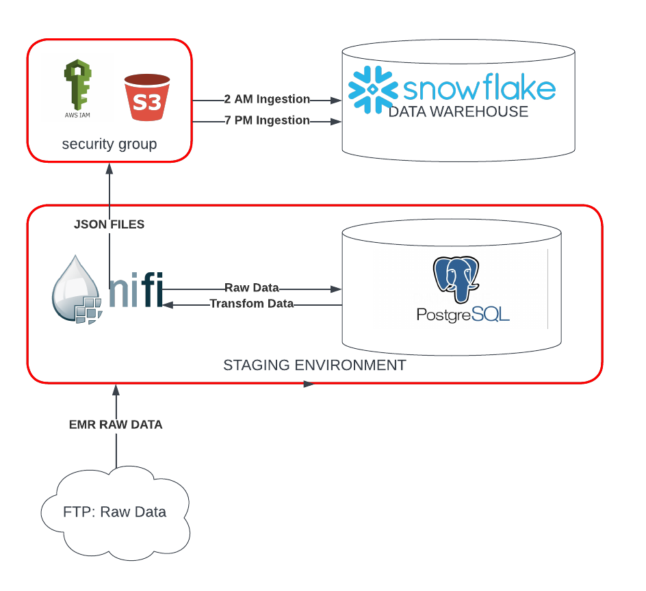

<!-- ABOUT THE PROJECT -->

$${\color{red}Still \space working \space on \space project}$$

## <center>$${\color{blue}Overcoming \space EMR \space Challenges \space with \space Cloud-Based \space Solutions:}$$</center>
<br>
<br>

#### <font color="blue"><em><center>Harnessing Cloud Technology for an Efficient Data Warehouse Solution</em></center></font>
I worked for a health company that encountered a major issue with their EMR system because it did not align with their business process. In turn, this caused the system to be buggy, as too many custom builds were implemented. The company decided to move away from their current system and instead implemented eClinicalWorks. The EMR company owned the database, so my company had to arrange an amendment to the contract that enables them to extend their usage agreement. The EMR company also agreed to FTP the live data files before work begins at 2:00 am and after work ends at 7:00 pm.
<br><br>
My job was to design and implement a data warehouse from these files. The requirements included creating various production reports and KPI’s that matched with the EMR system. The business owners would compare eClinicalWorks integrated reports with my reports and if aligned, they would be flagged to be used for production. In the company’s view, this was critical for data migration because it guaranteed that all operational reports would be correct and more importantly, would prove that eClinicalWorks was configured based on the company’s business requirements.
<br><br>
My intention with this project is to replicate some of the more important aspects of the above scenario. Please note that the healthcare dataset is fake and is being used only for demonstration purposes.

---------------------------------------------------------------------------------------------------------------------
### Agenda

- Cloud-Based Solutions: Healthcare Data Warehouse
  - `Configuration Approach:`
    - Setting up Jupyter Lab:
      - Environment setup and configuration.
      - Best practices for Python scripting for ETL processes.
    - Installing and Configuring S3:
      - Set up AWS S3 and Service Manager: Parameter Store.
      - Emphasize versioning or timestamping files in S3.
      - Security and data access controls.
    - Setting Up Snowflake:
      - Install Snowflake.
      - Determine stakeholders and required levels of access.
      - Create Snowflake Data Warehouse and Database.
      - Set up bulk loading mechanisms for efficient data ingestion.
    - Installing and Configuring Airflow:
      - Installing and initializing Airflow.
      - Create Airflow test script for troubleshooting and testing.
      - Test and validate each task.
      - Integrate with Snowflake and validate their relationship.
    - Installing and Configuring DBT:
      - Install DBT.
      - Create and test a DBT profile.
      - Design and implement models.
      - Implement Star Schema.
      - Create tasks in Airflow for DBT and test them.
      - Emphasize creating tests within dbt for data validation.
    - Alerting and Monitoring:
      - Install Slack and set up integrations.
      - Create and test Slack alerts for each significant step (S3 ingestion, transformations in Snowflake, etc.).
      - Implement monitoring for data anomalies or volume changes.
	- Cloud-Based Solutions: Healthcare Data Warehouse
  - `Ingestion Approach:`
    - Python Scripting with Jupyter Lab:
      - Design the Python script to:
	      - Read CSV files.
	      - Cleanse and validate data for consistency.
	      - Handle missing values or anomalies.
	      - Implement logging for transparency and easier debugging.
	      - Set up an automated routine to execute scripts. Consider scheduling tools or triggering mechanisms.
    - AWS S3:
      - Determine folder structures in S3 to organize the data efficiently. You might need landing, processing, and archive areas.
      - Develop naming conventions for S3 objects for easier traceability.
      - Implement S3 bucket policies for data retention and security.
      - Slack notification on successful data push to S3 or failure.
  - `Orchestration Approach:`
    - Apache Airflow:
      - Design DAGs for different workflows – data ingestion, transformation, and reporting.
	      - Set up error handling mechanisms in Airflow to handle failures or inconsistencies.
	      - Implement logging and monitoring to keep track of DAG runs.
	      - Implement retries and alert mechanisms in case of DAG failures.
	      - Ensure there's a solid connection setup between Airflow and Snowflake.
  - `Storage & Preprocessing Approach:`
    - Snowflake:
      - Design Snowflake schemas to hold raw and transformed data.
      - Create roles and grant permissions to ensure data security and compliance.
      - Implement Snowflake best practices such as using time-travel, fail-safe, and zero-copy cloning.
      - Load raw data from S3 to Snowflake tables.
      - Slack notification post successful load or upon failure.
  - `Transformation & Modeling Approach:`
    - dbt:
      - Set up dbt projects and profiles.
      - Design dbt models to transform raw data into a star schema, creating dimensions and fact tables.
      - Implement dbt tests to ensure data quality and consistency.
      - Integrate dbt runs with Airflow to automate transformations.
      - Ensure that the transformed data in Snowflake matches the EMR system reports.
  - `Alerting & Monitoring:`
    - Slack:
      - Integrate Slack with every major component for instant alerts.
      - Design alerts for both successful processes and failures.
      - Include error messages or anomalies in Slack alerts for quick troubleshooting.
      - Consider setting up dashboards or monitoring tools to visualize pipeline health and data metrics.
  - `Reporting Approach:`
    - Tableau:
      - Tableau Server/Online Setup:
      - If you haven’t already, set up Tableau Server or Tableau Online based on your requirements.
      - Ensure you have the necessary infrastructure and licensing in place.
      - Consider setting up projects, sites, and permission structures for better organization and security.
    - Connectivity to Snowflake:
      - Establish a connection between Tableau and Snowflake. Make use of the native Snowflake connector in Tableau.
      - Ensure your Snowflake user has the required permissions to access the relevant data for reporting.
      - Regularly update the connection credentials to maintain security.
    - Dashboard Design:
      - Begin by understanding the reporting requirements and KPIs from the business teams.
      - Create calculated fields, parameters, and sets in Tableau, if required, to match your KPI definitions.
      - Design your dashboards keeping the end-user in mind. Use intuitive layouts, meaningful color schemes, and clear visualizations.
    - Optimization:
      - Implement Extracts instead of Live Connections if you notice performance issues. Schedule refreshes according to business needs.
      - Optimize your Snowflake views or tables for faster query performance. Consider using materialized views or aggregated tables for reporting.
    - Collaboration:
      - Share your dashboards with the stakeholders using Tableau Server or Online.
      - Enable subscriptions to dashboards for key stakeholders to receive automated updates.
    - Feedback Loop:
      - Collect feedback from users regarding the reports. This can help in refining and making necessary adjustments to the dashboards for better decision-making.
    - Documentation:
      - It's crucial to document the design, business logic, and any other technical details of your Tableau dashboards. This ensures clarity and makes any future transitions or troubleshooting more manageable.
    - Integration with Slack (Optional):
      - If you want to share insights directly in Slack or notify users when a new report is available, consider integrating Tableau with Slack using webhooks or third-party integrations.

#### <font color="green"><left>PHASE ONE: Data Ingestion, Data Storage, Data Warehouse Layers</left></font>
---------------------------------------------------------------------------------------------------------------------
<br>

<details>
<summary>

##### Cloud Technology: [Apache Airflow](https://airflow.apache.org/), [Slack](https://slack.com/),[S3](https://aws.amazon.com/), [Snowflake](https://www.snowflake.com/en/),[DBT](https://www.getdbt.com/)

</summary>

### Ingestion Approach
The Ingestion Approach serves as the foundation for ensuring all components of your data pipeline are correctly installed and configured. The primary components include:

- **Airflow**: Handles ETL orchestration.
- **AWS S3**: Serves as the data storage.
- **AWS Systems Manager Parameter Store**: Manages secure configuration.
- **Snowflake**: Functions as the cloud data warehouse solution.
- **DBT**: Used for data transformation tasks.
- **Slack**: Sends process notifications.

#### Ingestion Approach Diagram


---

<details>
<summary>
    
##### Setting Up the AWS Environment
</summary>

1. **Environment Setup and Configuration**:

   - **S3 bucket**:
     ```shell
     aws s3api create-bucket --bucket YOUR_BUCKET_NAME --region YOUR_REGION
     ```

   - **IAM User 'testjay'**:
     ```shell
     aws iam create-user --user-name testjay
     ```

   - **S3 bucket policy for the user**:
     ```shell
     aws iam list-policies
     aws iam attach-user-policy --user-name jay --policy-arn YOUR_BUCKET_POLICY_ARN
     ```

   - **IAM Role 'developer'**:
     ```shell
     aws iam create-role --role-name developer --assume-role-policy-document '{"Version": "2012-10-17","Statement": [{"Effect": "Allow","Principal": {"Service": "ec2.amazonaws.com"},"Action": "sts:AssumeRole"}]}'
     ```

   - **SSM policy for the role**:
     ```shell
     aws iam list-policies
     aws iam attach-role-policy --role-name developer --policy-arn YOUR_SSM_POLICY_ARN
     ```

   - **Link the role to the user**:
     ```shell
     aws iam put-user-policy --user-name jay --policy-name AssumeDeveloperRole --policy-document '{"Version": "2012-10-17","Statement": [{"Effect": "Allow","Action": "sts:AssumeRole","Resource": "arn:aws:iam::YOUR-AWS-ACCOUNT-ID:role/developer"}]}'
     ```

2. **EMR Full Access for S3 Bucket**:

   - **Bucket Policy**:
     ```json
     {
        "Version": "2012-10-17",
        "Statement": [
            {
                "Effect": "Allow",
                "Principal": {
                    "Service": "elasticmapreduce.amazonaws.com"
                },
                "Action": "s3:*",
                "Resource": "arn:aws:s3:::YOUR_BUCKET_NAME/*"
            }
        ]
     }
     ```

   - **Apply the policy**:
     ```shell
     aws s3api put-bucket-policy --bucket YOUR_BUCKET_NAME --policy file://path/to/your/emr-policy.json
     ```

3. **AWS Systems Manager Parameter Store**:

   - **Setup Parameters**:
     ```shell
     aws ssm put-parameter --name "SnowflakeUsername" --type "String" --value "YourUsername"
     aws ssm put-parameter --name "SnowflakePassword" --type "SecureString" --value "YourPassword"
     aws ssm put-parameter --name "SnowflakeAccount" --type "String" --value "YourAccount"
     aws ssm put-parameter --name "SnowflakeRole" --type "String" --value "YourRole"
     ```

</details>

<details>
<summary>

##### Setting Up Snowflake
</summary>

1. **Getting Started with Snowflake**: 
   - **Setting up an Account**: Snowflake operates as a cloud-native data platform, eliminating the need for traditional installations.
      - Navigate to the [Snowflake website](https://www.snowflake.com/).
      - Opt for 'Start for Free' or 'Get Started'.
      - Complete the on-screen registration.
      - Access the Snowflake Web UI with your account credentials.

2. **Structural Setup**:
   - **Create a Data Warehouse**:
     ```sql
     CREATE WAREHOUSE IF NOT EXISTS my_warehouse 
        WITH WAREHOUSE_SIZE = 'XSMALL' 
        AUTO_SUSPEND = 60 
        AUTO_RESUME = TRUE 
        INITIALLY_SUSPENDED = TRUE;
     ```
     
   - **Generate a Database**:
     ```sql
     CREATE DATABASE IF NOT EXISTS my_database;
     ```

   - **Construct Roles and Users**:
     ```sql
     -- Role Creation
     CREATE ROLE IF NOT EXISTS my_role;
     
     -- User Creation
     CREATE USER IF NOT EXISTS jay 
        PASSWORD = '<YourSecurePassword>' 
        DEFAULT_ROLE = my_role
        MUST_CHANGE_PASSWORD = FALSE;
     ```

3. **Data Organization**:
   - **Establish Schemas**:
     ```sql
     USE DATABASE my_database;

     CREATE SCHEMA IF NOT EXISTS chart;
     CREATE SCHEMA IF NOT EXISTS register;
     CREATE SCHEMA IF NOT EXISTS billing;
     ```

   - **Develop Tables**:
     ```sql
     -- Chart Schema
     CREATE TABLE IF NOT EXISTS chart.code (
        id INT AUTOINCREMENT PRIMARY KEY
        -- Additional fields as necessary
     );

     -- Register Schema
     CREATE TABLE IF NOT EXISTS register.users (
        id INT AUTOINCREMENT PRIMARY KEY,
        name STRING,
        email STRING UNIQUE
        -- Additional fields as necessary
     );

     ... [Continue with the rest of the table creation commands]
     ```

4. **Allocate Permissions**:
   - **Role Assignments and Privileges**:
     ```sql
     -- Role assignment to user
     GRANT ROLE my_role TO USER jay;

     -- Database and warehouse privileges
     GRANT USAGE ON DATABASE my_database TO ROLE my_role;
     GRANT USAGE ON WAREHOUSE my_warehouse TO ROLE my_role;

     -- Schema permissions
     GRANT USAGE ON SCHEMA chart TO ROLE my_role;
     GRANT USAGE ON SCHEMA register TO ROLE my_role;
     GRANT USAGE ON SCHEMA billing TO ROLE my_role;

     -- Table permissions within schemas
     GRANT SELECT, INSERT, UPDATE, DELETE ON ALL TABLES IN SCHEMA chart TO ROLE my_role;
     GRANT SELECT, INSERT, UPDATE, DELETE ON ALL TABLES IN SCHEMA register TO ROLE my_role;
     GRANT SELECT, INSERT, UPDATE, DELETE ON ALL TABLES IN SCHEMA billing TO ROLE my_role;
     ```

**Note**: Make sure to replace placeholders (like `<YourSecurePassword>`) with actual values before executing the commands.

</details>

--            
 
</details>

  <details>
<summary>
  
 ##### Installing and Configuring Airflow:
</summary>
    
- Incorporating a staging database may seem like an unnecessary step since the files are already standardized. However, there are several benefits to consider. Firstly, it provides cost-effectiveness. Utilizing the cloud for repeated SELECT operations can be expensive. Secondly, the staging database allows for the identification of any unforeseen data issues and enables additional data cleansing and standardization processes. The ultimate goal is to minimize the number of updates and inserts into Snowflake, ensuring optimal efficiency.
- ***FTP LOCATION***: I used python script to create a `timestamp` and `increment count` for each file.
  - `Python Script`:[Script](code): I also implement `Slack` to notify me that the file reachs `2:AM Before work and 7:PM `
  - To integrate the Incoming `Webhooks` feature into the code, you'll need to make the following modifications:
    1. Install the slack_sdk library if you haven't already: `pip install slack_sdk`
    2. Import the necessary modules: `from slack_sdk import WebClient`,`from slack_sdk.errors import SlackApiError`
    3. Set up the Slack webhook URL: `slack_webhook_url = 'YOUR_SLACK_WEBHOOK_URL'`: Click here to view script [Script](code)

- Automate configuration file within parameter-context 
    - ***Create two folders***: Process-Nifi and parameter_context
    - /opt/nifi-toolkit/nifi-envs/`Process-Nifi/parameter_context` and add the files [`postgres-config.json`](parameter-context) to the folder
    - ***Start Nifi-toolkit***: `/opt/nifi-toolkit/bin/cli.sh`
    - ***Create the parameter Context for database***:
    `nifi import-param-context -i /opt/nifi-toolkit/nifi-envs/Excel-NiFi/parameter_context/postgres-config.json' -u http://localhost:8443`
    - ***Create the parameter Context for file Tracker***:
    `nifi import-param-context -i /opt/nifi-toolkit/nifi-envs/Excel-NiFi/parameter_context/excell-healthcare-tracker-config.json' -u http://localhost:8443`
    - ***Goto your nifi web location***: `http:/localhost:8443/nifi/`
    - ***Open Nifi***: In the top right corner click the icon and click on `Parameter Contexts` to confirm that the above files are loaded
    - *** Global Gear***: Click on it and search in the `Process Group Parameter Context` for your loaded files and click apply
        - Drag Process Group icon onto the plane and name it `Healthcare Data Process` then double click to open another plane
        - Drag another `Process Group` and name it `File Extraction to Databases`
            - Click the process group `File Extraction to Database` and then Drag the Processor and type `List File`
                - In the ListFile processor the file configuration should be loaded inplace automatically
                - ***Input Directory*** : `#{source_directory}`
                - ***File Filter*** : `#{file_list}`
                - ***Entity Tracking Node Identifier*** : `${hostname()}`

            - Drag the Processor and type `FetchFile`
                - ***File to Fetch*** : `${absolute.path}/${filename}`
                - ***Move Conflict Strategy*** : `Rename`
            
            - Drag the Processor and type `ConvertRecord`: Read CSV files and convert to `JSON`
                - ***Record Reader*** :`CSVReader`: we needed configure a `Controller Service Details` click on `properties`
                    - ***Schema Access Strategys*** : `Infer Schema`
                    - ***CSV Parse*** : `Apache Commons CSV`
                    - ***CSV Format*** : `Microsoft Excel`
                - ***Record Writer*** : `JsonRecordSetWriter`
                    - ***Schema Write Strategy*** : `Set 'avro.schema' Attribute`
                    - ***Schema Access Strategy*** : `Inherit Record Schema`
                    - ***Output Grouping*** : `Array`
                    - ***Compression Format*** : `None`

            - Drag the Processor and type `ConvertJSONToSQL`: Read JSON files and convert to `SQL Queries`
                - ***JDBC Connection Pool*** :`JPostgreSQL-DBCPConnectionPool`: we needed configure a `Controller Service Details` click on `properties`

                - NIFI upload JSON config file for Database: `JPostgreSQL-DBCPConnectionPool`
                -----------------------------------------------------------------------------
                 <br>
                
                - ***Statement Type*** : `INSERT`
                - ***File Filter*** : `#{filename:replace('.csv')}`
              

            - Drag the Processor and type `PUTSQL`: Read JSON files and convert to `SQL Queries INSERT`
                - ***JDBC Connection Pool*** :`JPostgreSQL-DBCPConnectionPool`: we needed configure a `Controller Service Details` click on `properties`
                - ***Batch Size*** : `1000`
                - ***Rollback On Failure*** : `true`

               - NIFI Data Flow `Set up scheduled or event-driven processes to load data from NiFi into PostgreSQL`
                -----------------------------------------------------------------------------
                 <br>

               - ***Stage Database***: `PostgreSQL Database` Ingest Results
                -----------------------------------------------------------------------------
               <br>
                
</details>

  <details>
<summary>
  
 ##### 4) Goto [NIFI](http:/localhost:8443/nifi/): Automate PostgreSQL Database to Store JSON File in AWS (S3)
</summary>
    
- ***Staging Database (PostgreSQL)***: The staging database acts as an intermediary storage area where the raw data from the ingestion layer is initially stored. It provides a temporary storage location for data cleansing, validation, and transformation processes.
***Cloud Storage (S3)***: The cloud storage, such as Amazon S3, is used to store the processed and transformed data. It provides scalable and cost-effective storage for large volumes of data, ensuring durability and availability.
- ***Data Transformation and Staging***: A Guide below but`Beyond the scope of the project`
    - Install and configure PostgreSQL database on a dedicated server or cluster
    - Create the necessary tables and schemas in PostgreSQL to stage the incoming data
    - Design SQL scripts or stored procedures to perform data transformation, standardization, and cleansing based on specific business rules
    - Implement data validation and quality checks to ensure the integrity of the staged data
    - Set up scheduled or event-driven processes to load data from `NiFi PostgreSQL to Storage (S3)`.
-AWS S3 CONFIGURATION
----------------------------------------
- **Create a User**:
    - Login to the `AWS Management Console`
    - In the search bar, type `IAM` and click on `IAM (Identity and Access Management)`
    - Click on `Users` from the left-hand menu and then click on `Add User`
    - Enter a name for the user and select `Programmatic access` for the `Access type`
    - Click on `Next: Permissions` and then select `Attach existing policies directly`
    - Search for and select the `AmazonS3FullAccess` policy
    - Click on `Next: Tags` (optional) and then click on `Next: Review`
    - Review the user details and click on `Create user`
    - Take note of the `Access key ID` and `Secret access key` as you will need them in the Nifi configuration

- **Create an S3 Bucket**:
    - Go to the `AWS Management Console`
    - In the search bar, type `S3` and click on `S3`
    - Click on `Create bucket`
    - Enter a unique name for the bucket and choose the region
    - Click on `Next` and leave the rest of the settings as default
    - Click on `Next` and review the bucket settings
    - Click on `Create bucket`

 - ***Start Nifi***: `/opt/nifi-prd/bin/nifi.sh start`
 - ***Goto your nifi web location***: `http:/localhost:8443/nifi/`
    - Drag another `Process Group` and name it `Database Extraction to AWS(S3)`
    - Click the process group `Database Extraction to AWS(S3)` and then Drag the Processor and type `ExecuteSQL`
    - In the `ExecuteSQL processor` we need to query the tables
        - ***Database Connection Pooling Service*** : `PostgreSQL-DBCPConnectionPool`
            - ***SQL select query*** : `SELECT * FROM CHARGES` -> `We can make this more dynamic however, Its beyond the Scope`
        - Drag the Processor and type `ConvertRecord`: follow the previous config 
        - Drag the Processor and type `UpdateAttribute`: Reads the table names
            - ***Click `+` and name `filename`*** :`${sql.tablename}.json`: returns json file
        - Drag the Processor and type `PutS3Object`: sends the file to Storage (S3)
            - ***Object Key***: `${filename}`
            - ***Bucket*** : The Name you gave your `S3 Storage`
            - ***Access Key ID*** : `Sensitive value set`
            - ***Secret Access key*** :  `Sensitive value set`
            - ***Storage Class*** : `Standard`
            - ***Region*** : `Where your AWS Account is located`

              - ***Stage Database***: `PostgreSQL Database`-> Click [Here](https://github.com/Jayboy628/DataDrivenHealthcare/blob/main/code/Load.ipynb) To View Code

              - ***NIFI Data Flow***: `PostgreSQL Database`
            -----------------------------------------------------------------------------
             <br>

              - ***AWS Storage***: `S3`
            -----------------------------------------------------------------------------
             <br>


</details>
</details>

#### <font color="green"><left>PHASE TWO: Data Transformation, Documentation Layers</left></font>
---------------------------------------------------------------------------------------------------------------------
<details>
    
<summary>


##### Cloud Technology: [S3](https://aws.amazon.com/) and [Snowflake](https://www.snowflake.com/en/) (SQL)

</summary>

##### 5) Goto [Snowflake](https://app.snowflake.com/): AWS (S3) to Snowflake

### Load Approach
-----------------------

<p>
The next step is to populate the cloud database. Snowpipe will pull the normalized JSON files from AWS into tables. As previously stated, the agreement with the EMR company was to FTP the files twice a day. I would be required to configure the load by creating a Task (Acron) and a Stream (CDC). This would enable triggers for a scheduled load and would continuously update the appropriate tables.
</p><br>
<p>
  - **Implementing Slowly Changing Dimensions*** `(SCD) Type 2` in healthcare can provide invaluable insights and support
    data integrity in various use-cases. 
    Here are a few scenarios where it might be relevant:
    Patient Information Tracking: Patients' personal details or health status might change over time. SCD Type 2 would help keep track of these changes without losing the history. For example, if a patient's address changes or a patient's health condition improves or worsens, the latest information is always available and the history is preserved for any trend or recovery analysis.
  </p>

- `PROCESS TRACKING TYPE 2`
<p>
  ***Healthcare Provider Details***: Information about healthcare providers, like doctors or nurses, can also change. For instance, a doctor might change their specialty or a nurse might move to a different department or hospital. SCD Type 2 can be used to track these changes over time.
</p>

- `Table: provider_details`
<p>
***Healthcare Plan Changes***: Healthcare insurance plans can change. With SCD Type 2, changes can be tracked effectively, including coverage details or costs. This can be important for patient billing and understanding how plans have evolved over time.
</p>
- `Table: insurance_plan_details`

In each of these cases, a change to the current record results in an update to the end_date of the current record (with the current_flag set to FALSE) and the insertion of a new record with the updated details (with the current_flag set to TRUE and end_date as NULL). This allows the system to always have a pointer to the most current information while retaining historical changes.

- 1) ***Creating a Snowflake Account***: `First`, you need to create a Snowflake account, if you don't already have one.


- ### Implementing Dedicated Virtual Warehouse
- 2) ***Create Warehouse***: for this example we create a Warehouse called `HEALTHCARE_WH` SEE BELOW!

<table>
<tr> 
    <th><h5>CREATE DATA WAREHOUSE (SQL)</h5></th>
</tr>
<tr>
<td>  
<pre lang="js">
USE ROLE ACCOUNTADMIN;

    CREATE WAREHOUSE HEALTHCARE_WH 
    WITH WAREHOUSE_SIZE = 'XSMALL'
    WAREHOUSE_TYPE = 'STANDARD' 
    AUTO_SUSPEND = 300 
    AUTO_RESUME = TRUE 
    MIN_CLUSTER_COUNT = 1 
    MAX_CLUSTER_COUNT = 1 
    SCALING_POLICY = 'STANDARD'
    COMMENT = 'This is  a Data Warehouse for Healthcare';

</pre>
</td>
</tr>
</table>

- 3) ***Creating Roles and Users***: `You can create roles` and users by executing the following commands:

  ```
  CREATE ROLE dev_role;
  GRANT ROLE dev_role TO USER your_username;
  CREATE USER dev_user PASSWORD = 'YourPassword' MUST_CHANGE_PASSWORD = TRUE DEFAULT_ROLE = dev_role;
  ```

- 4) ***House Work***: Best practice is to create your own `ROLE` and give correct 
permission`HEALTHCARE_WH` SEE BELOW!
<table>
<tr> 
    <th><h5>CREATE PERMISSION FOR ROLES (SQL)</h5></th>
</tr>
<tr>
<td>  
<pre lang="js">

  - ***CREATE ROLE FOR TRANSFOMATION***:`CREATE ROLE TRANSFORM_ROLE;`
  - ***GRANT PRIV SYSADMIN***: `GRANT MODIFY ON WAREHOUSE HEALTHCARE_WH TO ROLE ACCOUNTADMIN;`    
  - ***Create Databases (SQL)***: 
    - `CREATE DATABASE HEALTHCARE_RAW;` AND 
    - `CREATE DATABASE HEALTHCARE_DEV;` AND 
    - `CREATE DATABASE HEALTHCARE_PROD;`
  - ***MODFIY DATABASE PRIV (SQL)***:
    - `GRANT MODIFY ON DATABASE HEALTHCARE_RAW TO ROLE TRANSFORM_ROLE;` AND 
    - `GRANT MODIFY ON DATABASE HEALTHCARE_DEV TO ROLE TRANSFORM_ROLE;`AND
    - `GRANT MODIFY ON DATABASE HEALTHCARE_PROD TO ROLE TRANSFORM_ROLE;`
  - ***GRANT PRIVALEGE ON RAW DATABASE FOR SCHEMA,TABLES AND VIEWS(SQL)***:
    - `GRANT USAGE ON DATABASE HEALTHCARE_RAW TO ROLE TRANSFORM_ROLE;`AND
    - `GRANT USAGE ON DATABASE HEALTHCARE_DEV TO ROLE TRANSFORM_ROLE;` AND
    - `GRANT USAGE ON DATABASE HEALTHCARE_PROD TO ROLE TRANSFORM_ROLE;`
  - ***GRANT PRIVALEGE ON HEALTHCARE_RAW DATABASE FOR SCHEMA,TABLES AND VIEWS(SQL)***:
    - `GRANT CREATE SCHEMA ON DATABASE HEALTHCARE_RAW TO ROLE TRANSFORM_ROLE;` AND
    - `GRANT MODIFY ON DATABASE HEALTHCARE_RAW TO ROLE TRANSFORM_ROLE;` AND 
    - `GRANT MODIFY ON ALL SCHEMAS IN DATABASE HEALTHCARE_RAW TO ROLE TRANSFORM_ROLE;`
  - ***GRANT USAGE ON DATABASE HEALTHCARE_RAW TO ROLE TRANSFORM_ROLE;***
    - `GRANT USAGE ON ALL SCHEMAS IN DATABASE HEALTHCARE_RAW TO ROLE TRANSFORM_ROLE;`AND
    - `GRANT SELECT ON ALL TABLES IN DATABASE HEALTHCARE_RAW TO ROLE TRANSFORM_ROLE;`AND
    - `GRANT SELECT ON ALL VIEWS IN DATABASE HEALTHCARE_RAW TO ROLE TRANSFORM_ROLE;`
  - ***CREATE SCHEMA***: `CREATE SCHEMA HEALTHCARE_RAW.EMR;`


</pre>
</td>
</tr>
</table>

<table>
<tr> 
    <th><h5>CREATE TABLES (SQL)</h5></th>
</tr>
<tr>
<td>  
<pre lang="js">
    

  - ***CREATE TABLE EMR.patient(***
    - patientPK varchar(255)	    NOT NULL
    - ,PatientNumber varchar(255)	NULL
    - ,FirstName varchar(255)	    NULL
    - ,LastName varchar(255)      NULL
    - ,Email varchar(255)	        NULL
    - ,PatientGender varchar(255)	NULL
    - ,PatientAge int	            NULL
    - ,City varchar(255)          NULL
    - ,State varchar(255)		      NULL); 

  - ***CREATE TABLE EMR.doctor(***
	   - doctorPK varchar(255)	Not NULL 
	   - ,ProviderNpi varchar(255)	NULL
	   - ,ProviderName varchar(255) NULL
	   - ,ProviderSpecialty varchar(255)	NULL
	   - ,ProviderFTE decimal(10,2)	NULL Default 0);

  - ***CREATE TABLE EMR.charge(***
    - chargePK varchar(255)	Not NULL
    - ,TransactionType varchar(255)	NULL
    - ,Transaction varchar(255)	NULL
    - ,AdjustmentReason varchar(255) NULL);

  - ***CREATE TABLE EMR.payer(***
	 - payerPK varchar(255)	Not NULL
	 - ,PayerName varchar(255)	NULL ); 
    
  - ***CREATE TABLE EMR.location(***
	 - locationPK varchar(255)	Not NULL 
	 - ,LocationName varchar(255) NULL);

  - ***CREATE TABLE EMR.diagnosis(***
	 - CodePK varchar(255)	Not NULL 
	 - ,DiagnosisCode varchar(255)	NULL
	 - ,DiagnosisCodeDescription varchar(255) NULL
	 - ,DiagnosisCodeGroup varchar(255)       NULL
   - ,effective_date CURRENT_TIMESTAMP()    NOT NULL
   - ,end_date DATE                         NULL
   - ,current_flag BOOLEAN                  NOT NULL);
    
  - ***CREATE TABLE EMR.Code(***
    - CodePK varchar(255)				          NOT NULL
    - ,CptCode varchar(255)				        NULL
    - ,CptDesc varchar(255)				        NULL
    - ,CptGrouping varchar(255)			      NULL
    - ,effective_date CURRENT_TIMESTAMP() NOT NULL
    - ,end_date DATE                      NULL
    - ,current_flag BOOLEAN               NOT NULL);

  - ***CREATE TABLE insurance_plan_details (***
    - plan_PK varchar(255)				          NOT NULL
    - ,plan_id varchar(255)                 NULL
    - ,coverage_details varchar(255)        NULL
    - ,costs INT                            NULL
    - ,effective_date CURRENT_TIMESTAMP() NOT NULL
    - ,end_date DATE
    - ,current_flag BOOLEAN);

  </pre>
</td>
</tr>
</table>


</details>


</details> 


<details>
    
<summary>

##### Cloud Technology: [DBT](https://www.getdbt.com/)(***SQL***)

</summary>

##### 6) Goto [DBT](https://auth.cloud.getdbt.com/login): Snowflake and DBT 

### Transformation, Documentation,  Approach
-----------------------------------------------------
<p>
Another requirement was implementing a Data Warehouse that enabled the stakeholders to view and compare the reports and KPIs. Since Data Warehouse usage is mainly for analytical purposes rather than transactional, I decided to design a Star Schema because the structure is less complex and provides better query performance. Documenting wasn’t required, however, adding the Data Build Tool (DBT) to this process allowed us to document each dimension, columns, and visualize the Star Schema. DBT also allowed us to neatly organize all data transformations into discrete models.
</p>

- DBT: Documentation and Transformation
  - Tables
    - Dimensions
    - Facts
    - SCD
      - Type-1
      - Type-2
    - build operational reports (push to BI Tool)
      
</details>
</details>

#### <font color="green"><left>PHASE THREE: Data Visualization & Reporting Layers</left></font>
---------------------------------------------------------------------------------------------------------------------
<details>
<summary>

#####  Cloud Technology: [Jupter Lab & Tableau](https://www.getdbt.com/)(***Python & SQL***)

</summary>

##### 7) Goto [DBT](https://auth.cloud.getdbt.com/login):  Python and Tableau 

### Analyze Approach
--------------------

<p>
My intention with this project is to replicate some of the more important aspects of the above scenario. <font color="red">Please note that the healthcare dataset is fake and is being used only for demonstration purposes.</font>
</p>

  - ***Jupyter Lab****
  ---------------------
  - `Revenue Cycle`
    - [Explore Data](https://github.com/Jayboy628/DataDrivenHealthcare/blob/main/revenue_cycle/exploring.ipynb)
        - RVU
        - Denial Analysis
        - Writeoffs
      - Visualization
        - LOS
    - Data Exploring
    - Data Cleansing
    - Recycle Revenue Reports
  - Tableau Healthcare Reports
    - Revenue Reports
    - PMI Reports
    - CMS Reports


</details>
