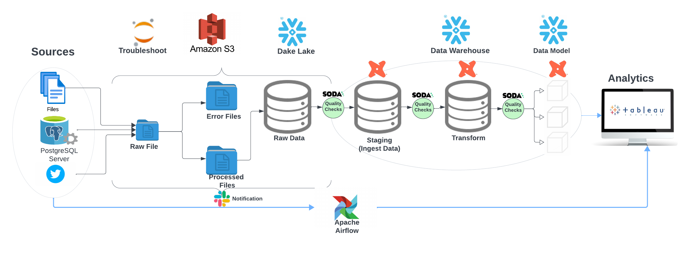
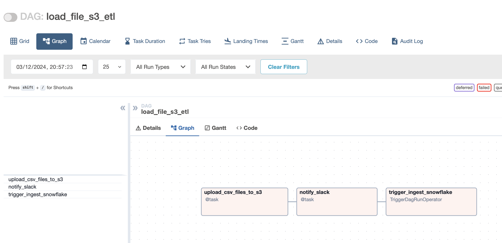
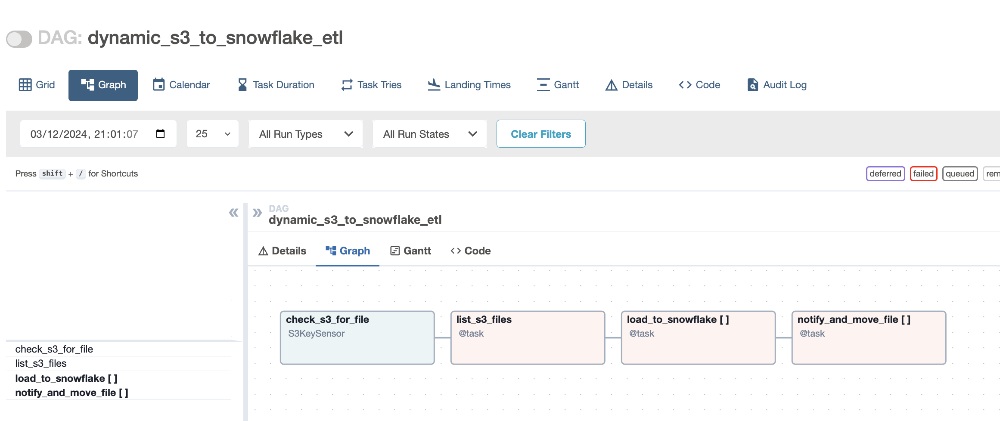

<!-- ABOUT THE PROJECT -->

$${\color{red}Still \space working \space on \space project}$$

## <center>$${\color{blue}Overcoming \space EMR \space Challenges \space with \space Cloud-Based \space Solutions:}$$</center>
<br>
<br>

#### <font color="blue"><em><center>Harnessing Cloud Technology for an Efficient Data Warehouse Solution</em></center></font>
I worked for a health company that encountered a major issue with their EMR system because it did not align with their business process. In turn, this caused the system to be buggy, as too many custom builds were implemented. The company decided to move away from their current system and instead implemented eClinicalWorks. The EMR company owned the database, so my company had to arrange an amendment to the contract that enables them to extend their usage agreement. The EMR company also agreed to FTP the live data files before work begins at 2:00 am and after work ends at 7:00 pm.
<br><br>
My job was to design and implement a data warehouse from these files. The requirements included creating various production reports and KPI’s that matched with the EMR system. The business owners would compare eClinicalWorks integrated reports with my reports and if aligned, they would be flagged to be used for production. In the company’s view, this was critical for data migration because it guaranteed that all operational reports would be correct and more importantly, would prove that eClinicalWorks was configured based on the company’s business requirements.
<br><br>
My intention with this project is to replicate some of the more important aspects of the above scenario. Please note that the healthcare dataset is fake and is being used only for demonstration purposes.

---------------------------------------------------------------------------------------------------------------------


## Cloud Technology Project

A comprehensive guide on setting up a data pipeline leveraging key cloud technologies: 
[Apache Airflow](https://airflow.apache.org/), [Slack](https://slack.com/), [AWS S3](https://aws.amazon.com/),[SODA](https://www.soda.com/),[Snowflake](https://www.snowflake.com/en/), [COSMOS](https://www.astronomer.io/cosmos/), [DBT](https://www.getdbt.com/) and [Tableau](https://www.tableau.com/).

---
### AGENDA
- [Data Modeling](https://towardsdatascience.com/data-modelling-for-data-engineers-93d058efa302)
  - Star Schema
- AWS Environment Setup:`Optional AWS CLI`
  - Create user
  - Create admin group
  - Create S3 bucket
  - Systems Manager Parameter: Optinal
- Snowflake Setup
  - Create Databases
  - Create Roles
  - Privilages
- DBT Setup:
  - Create Profile
- [Data Quality](https://www.montecarlodata.com/blog-data-quality-checks-in-etl/): example
  - Null values tests
  - Volume tests
  - Numeric distribution tests
  - Uniqueness tests
  - Referential integrity test
  - Freshness checks
- Ingestion Approach for Data Lake
  - Ingest and Notification
    - Files and Database
      - Raw
- Transformation Approach
  - Stage
  - Transform
- Reporting Approach
  
### Data Warehouse Architecture Approach

The Configuration Approach ensures that all data pipeline components are appropriately set up.
<br>


#### Components:

- **Airflow**: Manages ETL workflows.
- **AWS S3**: Acts as data storage.
- **AWS Systems Manager Parameter Store**: Secures configurations.`optional`
- **SODA**:Data Quality.
- **Snowflake**: Our cloud data warehouse.
- **COSMOS**: Integrate with DBT allow airflow to run
- **DBT**: Handles data transformations.
- **Slack**: Delivers process notifications.
- **Tableau**: Deliver reports and Dashboard


---

### 1. Modern Data Moderling

<details>
<summary>Click to Expand</summary>

#### 1. Introduction:

- **Overview**: The data model approach we will use is based on Ralph Kimball's methodology, which emphasizes the design of data warehouses built around the concept of dimensional modeling. This approach is highly focused on making databases understandable and accessible to business users and is particularly well-suited for data analytics and business intelligence purposes.

- **Star Schema**:n this structure, data is organized into fact tables and dimension tables. Fact tables contain the quantitative metrics of the business process, while dimension tables contain descriptive attributes related to the measurements in the fact tables.

#### Below is a simplified example of a healthcare star schema model

<br>
<br>


</details>


### 2. AWS Environment Setup

<details>
<summary>Click to Expand</summary>

#### 1. Basic Environment Configuration:

   - **S3 Bucket**: 
     ```shell
     aws s3api create-bucket --bucket YOUR_BUCKET_NAME --region YOUR_REGION
     ```

   - **IAM User 'testjay'**:
     ```shell
     aws iam create-user --user-name testjay
     ```

   - **S3 Bucket Policy**:
     ```shell
     aws iam list-policies
     aws iam attach-user-policy --user-name jay --policy-arn YOUR_BUCKET_POLICY_ARN
     ```

   - **IAM Role 'developer'**:
     ```shell
     aws iam create-role --role-name developer --assume-role-policy-document '{"Version": "2012-10-17","Statement": [{"Effect": "Allow","Principal": {"Service": "ec2.amazonaws.com"},"Action": "sts:AssumeRole"}]}'
     ```

   - **SSM Policy for Role**:
     ```shell
     aws iam list-policies
     aws iam attach-role-policy --role-name developer --policy-arn YOUR_SSM_POLICY_ARN
     ```

   - **Associate Role to User**:
     ```shell
     aws iam put-user-policy --user-name jay --policy-name AssumeDeveloperRole --policy-document '{"Version": "2012-10-17","Statement": [{"Effect": "Allow","Action": "sts:AssumeRole","Resource": "arn:aws:iam::YOUR-AWS-ACCOUNT-ID:role/developer"}]}'
     ```

#### 2. EMR Full Access for S3:

   - **Bucket Policy**:
     ```json
     {
        "Version": "2012-10-17",
        "Statement": [
            {
                "Effect": "Allow",
                "Principal": {
                    "Service": "elasticmapreduce.amazonaws.com"
                },
                "Action": "s3:*",
                "Resource": "arn:aws:s3:::YOUR_BUCKET_NAME/*"
            }
        ]
     }
     ```

   - **Apply Policy**:
     ```shell
     aws s3api put-bucket-policy --bucket YOUR_BUCKET_NAME --policy file://path/to/your/emr-policy.json
     ```

#### 3. AWS Systems Manager Parameter Store:

   - **Parameter Setup**:
     ```shell
     aws ssm put-parameter --name "SnowflakeUsername" --type "String" --value "YourUsername"
     aws ssm put-parameter --name "SnowflakePassword" --type "SecureString" --value "YourPassword"
     aws ssm put-parameter --name "SnowflakeAccount" --type "String" --value "YourAccount"
     aws ssm put-parameter --name "SnowflakeRole" --type "String" --value "YourRole"
     ```

</details>

### 3. Snowflake Setup

<details>
<summary>Click to Expand</summary>

#### 1. Starting with Snowflake:

   - Snowflake offers a cloud-native data platform.
      - [Register on Snowflake](https://www.snowflake.com/)
      - Choose 'Start for Free' or 'Get Started'.
      - Complete the registration.
      - Use credentials to access Snowflake's UI.

#### 2. Structure Configuration:

   - **Data Warehouse**:
     ```sql
     CREATE WAREHOUSE IF NOT EXISTS my_warehouse 
        WITH WAREHOUSE_SIZE = 'XSMALL' 
        AUTO_SUSPEND = 60 
        AUTO_RESUME = TRUE 
        INITIALLY_SUSPENDED = TRUE;
     ```

   - **Database**:
     ```sql
     CREATE DATABASE IF NOT EXISTS my_database;
     ```

   - **Roles and Users**:
     ```sql
     -- Role Creation
     CREATE ROLE IF NOT EXISTS my_role;
     
     -- User Creation
     CREATE USER IF NOT EXISTS jay 
        PASSWORD = '<YourSecurePassword>' 
        DEFAULT_ROLE = my_role
        MUST_CHANGE_PASSWORD = FALSE;
     ```

	 - **Show grants for a specific user on databases**: This command confirm what privilages you have
	 SHOW GRANTS TO USER USERS;

	 SHOW GRANTS TO ROLE ;

  - **Create Stage***
 	```sql
	 	// Step 1
	 	USE ROLE YOUR ROLE NAME;
	
	 	// Step 2 create external stage
	 	CREATE SCHEMA IF NOT EXISTS YOUR_MANAGE_DATABASE.SCHEMA;

	 	// Step 3
	 	CREATE OR REPLACE STAGE YOUR_MANAGE_DATABASE.SCHEMA.STAGE_NAME
	     	URL='s3://snowflake-emr/raw_files'
	     	CREDENTIALS=(AWS_KEY_ID='YOUR ID' AWS_SECRET_KEY='YOUR SECRET');

	 	   // view stage
	 	  DESC STAGE YOUR_MANAGE_DATABASE.SCHEMA.stage_name;

	 	 LIST @YOUR_MANAGE_DATABASE.SCHEMA.stage_name;


	 	// create file format
	 	CREATE OR REPLACE FILE FORMAT YOUR_MANAGE_DATABASE.SCHEMA.my_csv_format
	   	TYPE = 'CSV'
	   	FIELD_DELIMITER = ','
	   	SKIP_HEADER = 1
	   	FIELD_OPTIONALLY_ENCLOSED_BY = '"'
	   	NULL_IF = ('NULL', 'null')
	   	EMPTY_FIELD_AS_NULL = TRUE
	   	TRIM_SPACE = TRUE
	   	ERROR_ON_COLUMN_COUNT_MISMATCH = FALSE
	   	ESCAPE = 'NONE'
	   	ESCAPE_UNENCLOSED_FIELD = '\\';

	 	SHOW FILE FORMATS IN SCHEMA YOUR_MANAGE_DATABASE.SCHEMA;
	 	SHOW GRANTS ON FILE FORMAT YOUR_MANAGE_DATABASE.SCHEMA.my_csv_format;


	 	SHOW FILE FORMATS;


	 	COPY INTO HEALTHCARE_RAW.DATA_RAW.RAW_LOCATION
	 	FROM '@YOUR_MANAGE_DATABASE.SCHEMA.stage_name/raw_Location.csv'
	 	FILE_FORMAT = (FORMAT_NAME = 'MANAGE_DB.EXTERNAL_STAGES.MY_CSV_FORMAT');
	```
	 

#### 3. Organize Data:

   - **Schemas**:
     ```sql
     USE DATABASE my_database;
     CREATE SCHEMA IF NOT EXISTS chart;
     CREATE SCHEMA IF NOT EXISTS register;
     CREATE SCHEMA IF NOT EXISTS billing;
     ```

   - **Tables**:
     ```sql
     -- Chart Schema
     CREATE TABLE IF NOT EXISTS chart.code (
        id INT AUTOINCREMENT PRIMARY KEY
     );

     -- Register Schema
     CREATE TABLE IF NOT EXISTS register.users (
        id INT AUTOINCREMENT PRIMARY KEY,
        name STRING,
        email STRING UNIQUE
     );
     ```

#### 4. Permissions:

   - **Assign Roles and Grant Privileges**:
     ```sql
     GRANT ROLE my_role TO USER jay;
     GRANT USAGE ON DATABASE my_database TO ROLE my_role;
     GRANT USAGE ON WAREHOUSE my_warehouse TO ROLE my_role;
     GRANT USAGE ON SCHEMA chart TO ROLE my_role;
     GRANT SELECT, INSERT, UPDATE, DELETE ON ALL TABLES IN SCHEMA chart TO ROLE my_role;
     ```

**Note**: Replace placeholders (like `<YourSecurePassword>`) with actual values.

</details>

### 4. DBT (Data Build Tool) Setup


<details>
<summary>Click to Expand</summary>

**Note**: DBT (Data Build Tool) provides a means to transform data inside your data warehouse. With it, analytics and data teams can produce reliable and structured data sets for analytics.

   - **Installation**: To get started with DBT, you first need to install it 

     ```shell
      pip install dbt
     ```

   - **Initialize a New DBT Project**: Navigate to your directory of choice and initiate a new project

     ```shell
     dbt init your_project_name
     ```

   - ** Configuration**: Modify the ~/.dbt/profiles.yml to set up your Snowflake connection. This file will contain details such as account name, user, password, role, database, and warehouse.
     ```shell
        your_project_name:
      target: dev
      outputs:
        dev:
          type: snowflake
          account: your_account
          user: your_username
          password: your_password
          role: your_role
          database: your_database
          warehouse: your_warehouse
          schema: your_schema
          threads: [desired_number_of_threads]
     ```
     - **Running and Testing:

     ```shell
     dbt debug
     ```
</details>

### 5. Data Quality (SodaCL ) 


<details>
<summary>Click to Expand</summary>

**Note**: Along with `Data Quality Check` we should implement data [observability](https://www.montecarlodata.com/blog-what-is-data-observability/). `Barr Moses CEO and CO-founder of Monte Carlo` coind "Data observability" She explaind that Data observability provides full visibility into the health of your data AND data systems so you are the first to know when the data is wrong, what broke, and how to fix it.
- **The five pillars of data observability:** 
  - Freshness
  - Quality 
  - Volume 
  - Schema
  - Lineage
    
### Data Quality Checks
 - **1) Null Values Tests**: These checks ensure that essential columns do not contain null values. For the `dim_provider` table, it's crucial that primary key, NPI, first and last names, specialty, and email don't have nulls as they are essential for identifying and contacting the provider.
   ```shell
    checks for dim_provider:
      - missing_count(PROVIDER_PK) = 0
      - missing_count(PROVIDER_NPI) = 0
      - missing_count(FIRST_NAME) = 0
      - missing_count(LAST_NAME) = 0
      - missing_count(PROVIDER_SPECIALTY) = 0
      - missing_count(EMAIL) = 0
   ```
 - **2) Volume Tests**: Volume tests ensure the table contains a reasonable number of records, which can indicate whether the data loading process worked correctly.
     ```shell
      checks for dim_provider:
        - row_count between 100 and 10000
     ```
 - **3) Numeric Distribution Tests**: These tests can validate that numeric columns like `AGE` have values within expected ranges and distributions.
     ```shell
      checks for dim_provider:
        - invalid_percent(AGE) < 5%:
            valid min: 25
            valid max: 100
     ```
 - **4) Uniqueness Tests**: Uniqueness tests verify that columns that should be unique, such as `PROVIDER_NPI` and `EMAIL`, do not have duplicate values.
     ```shell
      checks for dim_provider:
        - duplicate_count(PROVIDER_NPI) = 0
        - duplicate_count(EMAIL) = 0
     ```     
- **5) Referential Integrity Test**: These tests ensure that values in a column match values in a column in another table, for example, ensuring that the `PROVIDER_SPECIALTY` exists in a `dim_specialty` table.
   ```shell
    checks for dim_provider:
      - duplicate_count(PROVIDER_NPI) = 0
      - duplicate_count(EMAIL) = 0
   ```

- **6) Freshness Checks**: Freshness checks are useful for tables that are expected to be updated regularly. If your table includes a timestamp column (not shown in your schema), you could implement a check like:
    ```shell
      checks for dim_provider:
        - freshness (LAST_UPDATE_TIMESTAMP) < 2d
    ``` 

</details>


## Ingestion Approach for Data Lake
Our ingestion approach is meticulously designed to ensure all components of the data pipeline are properly established and operational.


### Airflow: Orcahstrate the following:
  - **Sources**: ingest data into `raw_files` folder (S3 buckets) and issue an `alert`.
    - **Folder Management and Notification**:
      - errors: error files stored in the `error_folder` with a `Slack alert`.
      - processed: processed data is ingested into snowflake with a`Slack alert`


### 1. Project Environment

<details>
  <summary>Click to Expand: AWS S3 environment</summary>
  
  - Command to list S3 folders: `aws s3 ls s3://snowflake-emr`
     
      ```shell
        PRE error_files/
        PRE processed/
        PRE raw_files/
    ```
#### a. Naming Conventions:
  
  - Timestamps are used for file naming:
  
      ```python
        timestamp_str = datetime.now().strftime('%Y%m%d%H%M%S')
      ```
</details>
<details>
  <summary>Click to Expand: Data Quality checks environment (SODA)</summary>
  
  - **Command to list** : `ls include/soda/` and `ls include/soda/checks/`
     
      ```shell
        ls include/soda/
	__pycache__  check_function.py  check_transform.py  checks  config.py  configuration_bill.yml  configuration_chart.yml  configuration_register.yml  configuration_transform.yml
	
	ls include/soda/checks/
	bill_tables  chart_tables  register_tables  transform
	
	ls include/soda/checks/register_tables/
	raw_address.yml  raw_date.yml  raw_location.yml  raw_user.yml
    ```
  - **configuration_register.yml_** : `ls include/soda/` 
     
        ```shell
	      data_source healthcare_db:
	       type: snowflake
	       username: ${SNOWFLAKE_USER}
	       password: ${SNOWFLAKE_PASSWORD}
	       account: ${SNOWFLAKE_ACCOUNT}
	       database: RAW 
	       warehouse: your warehouse
	       connection_timeout: 240
	       role: your role
	       client_session_keep_alive: true
	       authenticator: snowflake
	       session_params:
	         QUERY_TAG: soda-queries
	         QUOTED_IDENTIFIERS_IGNORE_CASE: false
	       schema: REGISTER
	      data_source healthcare_dev:
	        type: snowflake
	        username: ${SNOWFLAKE_USER}
	        password: ${SNOWFLAKE_PASSWORD}
	        account: ${SNOWFLAKE_ACCOUNT}
	        database: DEV 
	        warehouse: your warehouse
	        connection_timeout: 240
	        role: your role
	        client_session_keep_alive: true
	        authenticator: snowflake
	        session_params:
	          QUERY_TAG: soda-queries
	          QUOTED_IDENTIFIERS_IGNORE_CASE: false
	        schema: your schema
	        soda_cloud:
	        host: cloud.us.soda.io
	        api_key_id: soda id
	        api_key_secret: soda secret
    ```
 - **raw_usser.yml** : `cat include/soda/checks/register_tables/`
    
     ```shell
	   checks for raw_user:
	     - schema:
	         fail:
	           when required column missing: [UIDPK, UID, UFNAME, ULNAME, EMAIL, GENDER, AGE, USERTYPE, UPDATE_AT]
	           when wrong column type:
	             UIDPK: NUMBER
	             UID: NUMBER
	             UFNAME: VARCHAR
	             ULNAME: VARCHAR
	             EMAIL: VARCHAR
	             GENDER: VARCHAR
	             AGE: NUMBER
	             USERTYPE: VARCHAR
	             UPDATE_AT: TIMESTAMP_NTZ
				 ```
</details>
<details>
  <summary>Click to Expand: Slack Notification </summary>
  
  #### a. Slack Notifications:
  
  - Slack webhook integration for notifications on success or failure: **lease ensure you've taken care of the security considerations (like not hardcoding AWS access keys or Slack Webhook URLs) when using these scripts in a real-world scenario. Use environment variables or secrets management tools instead**
  
      ```python
        SLACK_WEBHOOK_URL = 'https://hooks.slack.com/services/XXXXXXXXX/XXXXXXXXX/XXXXXXXXXXXXXX'  # Replace with your webhook URL
    
        def send_slack_message(message):
            #... [rest of the code]
      ```
      <br>
      
</details>

### 2. Aiflow(Astro) configuration

<details>
<summary>Click to Expand</summary>

#### a. airflow_setting:

- **Overview**:  Automate your Airflow configuration to avoid repetitive setup tasks each time Airflow is initiated. This approach enables configuring Airflow Connections, Pools, and Variables all in one place, specifically tailored for local development environments.
- **Variables to consider**
  - AWS login credentials
  - Snowflake login credentials
  - Slack connection details
  - S3 bucket specifics (name, key, prefix, processed, error paths)
  - Snowflake configurations (tables, schema, databases, stage)
  - Slack notifications (channel, token)
  - Local file path for datasets

- **Configuration in `airflow_setting.yaml`**: This YAML snippet defines essential Airflow configurations for seamless integration with AWS, Snowflake, and Slack, alongside managing S3 buckets and local datasets. Note: Ensure sensitive information like login credentials is securely managed and not hard-coded.

    ```python
      airflow:
        connections:
          - conn_id: aws_default
            conn_type: aws
            login: <aws_access_key_id>
            password: <aws_secret_access_key>
            extra:
              region_name: us-east-1
      
          - conn_id: snowflake_default
            conn_type: snowflake
            login: <your_snowflake_username>
            password: <your_snowflake_password>
            schema: DATA_RAW
            extra:
              account: <your_snowflake_account>
              warehouse: <your_snowflake_warehouse>
              database: <your_snowflake_database>
              role: <your_snowflake_role>
              region: us-east-1
      
          - conn_id: slack_default
            conn_type: slack
            password: <your_slack_bot_token>
      
        variables:
          # Snowflake and S3 configurations
          - variable_name: S3_BUCKET
            variable_value: "your_s3_bucket_name"
      
          # Additional configurations...
      
          # Slack notifications
          - variable_name: SLACK_CHANNEL
            variable_value: "#your_slack_channel"
      
          # Local dataset configurations
          - variable_name: LOCAL_DIRECTORY
            variable_value: "/path/to/your/local/dataset/"
    ```


#### b. Dockerfile Configuration:

- **Overview**: Customize the Dockerfile to include necessary installations for your Airflow environment.
- **Dockerfile Content**: This Dockerfile extends the Astronomer Astro Runtime image, incorporating additional packages and tools required for your workflows, such as AWS CLI, specific Airflow providers, and the Slack SDK.

    ```python
        FROM quay.io/astronomer/astro-runtime:10.4.0

        USER root
        
        # Install AWS CLI
        RUN apt-get update && \
            apt-get install -y awscli && \
            rm -rf /var/lib/apt/lists/*
        
        USER astro
        
        # Install Airflow providers and the Slack SDK
        RUN pip install --no-cache-dir apache-airflow-providers-slack apache-airflow-providers-amazon==8.11.0 slack_sdk
        
        # Configure environment variables for sensitive information
        ENV AIRFLOW__CORE__ENABLE_XCOM_PICKLING=True
        
        # Additional configuration...
    ```

#### c. Requirements :

- **Overview**: Define additional dependencies and packages required for your Airflow setup.
    ```python
      # Astro Runtime includes the following pre-installed providers packages: https://docs.astronomer.io/astro/runtime-image-architecture#provider-packages
      astro-sdk-python[amazon, snowflake] >= 1.1.0
      astronomer-cosmos[dbt.snowflake]
      apache-airflow-providers-snowflake==4.4.0
      soda-core-snowflake==3.2.1
      protobuf==3.20.0
    ```
</details>

### 3. Aiflow(Astro) dag

<details>
 <summary>Click to Expand: Load data into data lake </summary>
	
- **Overview**: The DAG defined in your script, `load_file_s3_etl`, is designed to automate the process of uploading CSV files from a local directory to an Amazon S3 bucket, notify a Slack channel about the upload status, and subsequently trigger another DAG for processing the uploaded data. It's structured to run daily without catching up on past executions. Here's an overview of its components and workflow:
- **Configuration**
	- Utilizes Airflow's Variable feature to dynamically set the S3 connection ID, bucket name, key, local directory, and Slack channel.
	- Employs Amazon AWS S3 and Slack providers for interactions with S3 and Slack, respectively.
    ```python
      	from airflow.decorators import dag, task
	from datetime import datetime
	from airflow.providers.amazon.aws.hooks.s3 import S3Hook
	from airflow.providers.amazon.aws.sensors.s3 import S3KeySensor
	from airflow.providers.slack.operators.slack import SlackAPIPostOperator
	from airflow.operators.dagrun_operator import TriggerDagRunOperator  # Added import
	from airflow.models import Variable
	import glob
	import os
	import logging

	# Configuration variables
	S3_CONN_ID = 'aws_default'
	S3_BUCKET = Variable.get('S3_BUCKET')
	S3_KEY = Variable.get('S3_KEY').rstrip('*.csv')
	LOCAL_DIRECTORY = Variable.get('LOCAL_DIRECTORY')
	SLACK_CHANNEL = Variable.get('SLACK_CHANNEL')  # Ensure this is set in Airflow Variables
	
	@dag(start_date=datetime(2023, 1, 1), schedule_interval='@daily', catchup=False, tags=['s3', 'slack'])
	def load_file_s3_etl():
	    @task
	    def upload_csv_files_to_s3(bucket: str, key: str, local_directory: str, aws_conn_id: str):
	        s3_hook = S3Hook(aws_conn_id=aws_conn_id)
	        uploaded_files_info = []
	        for filepath in glob.glob(os.path.join(local_directory, '*.csv')):
	            if not os.path.exists(filepath):
	                logging.error(f"File not found: {filepath}")
	                continue
	            filename = os.path.basename(filepath)
	            dest_key = os.path.join(key, filename)
	            s3_hook.load_file(filename=filepath, key=dest_key, bucket_name=bucket, replace=True)
	            file_size = os.path.getsize(filepath)
	            uploaded_files_info.append({'filename': filename, 'size': file_size})
	            os.remove(filepath)
	        return uploaded_files_info
	
	    @task
	    def notify_slack(uploaded_files_info):
	        if uploaded_files_info:
	            message = "Files successfully uploaded to S3:\n"
	            message += "\n".join([f"{file_info['filename']} (Size: {file_info['size']} bytes)" for file_info in uploaded_files_info])
	        else:
	            message = "No new files were uploaded to S3."
	        
	        SlackAPIPostOperator(
	                task_id="notify_slack",
	                channel=SLACK_CHANNEL,
	                text=message,
	                slack_conn_id="slack_default"  # Ensure this Slack connection is configured in Airflow
	            ).execute({})
	
	    
	    trigger_ingest_snowflake = TriggerDagRunOperator(
	    task_id="trigger_ingest_snowflake",
	    trigger_dag_id="dynamic_s3_to_snowflake_etl",
	    execution_date='{{ ds }}',  # Set the execution date explicitly
	    conf={"some_key": "some_value"},  # Any additional configuration
	    reset_dag_run=True,  # Optional: based on your need
	    wait_for_completion=True,  # Optional: based on your need
	    poke_interval=60,  # Optional: default is 60 seconds
	    allowed_states=['success'],  # Optional: default is ['success']
	    failed_states=['failed'],  # Optional
	    deferrable=False,  # Optional: based on your need
	)
	
	
	    uploaded_files_info = upload_csv_files_to_s3(S3_BUCKET, S3_KEY, LOCAL_DIRECTORY, S3_CONN_ID)
	    notify_slack_result = notify_slack(uploaded_files_info)
	    
	    notify_slack_result >> trigger_ingest_snowflake
	
	etl_dag = load_file_s3_etl()
    ```
	
    <br>
    
	
    #### Task
	1. `upload_csv_files_to_s3`:
	   - Scans a specified local directory for CSV files.
	   - Uploads each found CSV file to a specified S3 bucket and key location, replacing the file if it already exists.
	   - Records information about the uploaded files, such as their names and sizes, then deletes the local copies of these files.
	   - Returns a list of dictionaries, each containing information about an uploaded file.
	2. `notify_slack`:
	   - Takes the list of uploaded file information as input.
	   - If files were uploaded, constructs a message listing the names and sizes of the uploaded files.
	   - If no files were uploaded, prepares a message indicating that no new files were uploaded.
	   - Sends the prepared message to a specified Slack channel using the `SlackAPIPostOperator`.
	3. `trigger_ingest_snowflake`:
	   - Configured to trigger another DAG, presumably for processing the uploaded files in Snowflake, upon successful completion of the `notify_slack task`.
	   - Allows for additional configuration via the conf parameter, and offers options to reset the DAG run, wait for completion, and specify poke intervals and allowed/failed states for more controlled execution flow.

   #### Workflow
  	- The DAG starts with the `upload_csv_files_to_s3` task to upload CSV files from the local directory to S3.
  	- Next, the `notify_slack` task executes, sending a notification to Slack about the status of the upload.
  	- Finally, if the notification task succeeds, the trigger_ingest_snowflake task is executed to trigger another DAG for further processing, demonstrating a linear sequence of task dependencies.	  

   #### Features
  	- The DAG includes modern Airflow features, such as the use of the `@dag` and `@task` decorators for simplified DAG and task definitions.
  	- It showcases interaction with external systems (S3 and Slack) and the chaining of workflows via DAG triggering, making it a practical example of a data pipeline that incorporates data uploading, notification, and further data processing steps.

- **Overview**: This DAG, `dynamic_s3_to_snowflake_etl`, is an advanced data pipeline designed for automating data flows from AWS S3 to Snowflake and involves Slack for notifications. Let's review its tasks, workflow, and features:
  ```python
  	from datetime import datetime
	import pendulum
	from airflow.decorators import dag, task
	from airflow.models import Variable
	from airflow.providers.amazon.aws.hooks.s3 import S3Hook
	from airflow.providers.snowflake.hooks.snowflake import SnowflakeHook
	from airflow.operators.python import get_current_context
	
	from slack_sdk import WebClient
	from slack_sdk.errors import SlackApiError
	from airflow.operators.python import PythonOperator
	import json
	import logging
	from airflow.providers.amazon.aws.sensors.s3 import S3KeySensor
	
	# Configuration variables
	S3_BUCKET = Variable.get("S3_BUCKET")
	SNOWFLAKE_CONN_ID = "snowflake_default"
	SLACK_TOKEN = Variable.get("SLACK_TOKEN")
	SLACK_CHANNEL = Variable.get("SLACK_CHANNEL")
	SNOWFLAKE_STAGE_FULL_PATH = Variable.get("STAGE_NAME")
	SNOWFLAKE_TABLES = json.loads(Variable.get("SNOWFLAKE_TABLES", "[]"))
	S3_PREFIX = "raw_files/"
	S3_PROCESSED = "processed/"
	S3_ERROR = "error_files/"
	
	default_args = {
	    "owner": "airflow",
	    "depends_on_past": False,
	    "start_date": datetime(2021, 1, 1),
	}
	
	
	@dag(schedule="@daily", default_args=default_args, catchup=False, tags=["snowflake", "slack"])
	def dynamic_s3_to_snowflake_etl():
	    
	    is_file_available = S3KeySensor(
	        task_id='check_s3_for_file',
	        bucket_key=S3_PREFIX + '*.csv',  # Adjust the pattern to match your file naming
	        bucket_name=S3_BUCKET,
	        wildcard_match=True,
	        aws_conn_id='aws_default',
	    )
	
	
	    @task
	    def list_s3_files():
	        """List files in the specified S3 bucket and prefix."""
	        s3_hook = S3Hook(aws_conn_id="aws_default")
	        return s3_hook.list_keys(bucket_name=S3_BUCKET, prefix=S3_PREFIX)
	
	    @task
	    def load_to_snowflake(key: str) -> dict:
	        """Load a file to Snowflake, returning the file name and load status."""
	        file_name = key.split('/')[-1].split('.')[0].upper()  # Extract file name and convert to uppercase
	        if file_name in [table.upper() for table in SNOWFLAKE_TABLES]:
	            try:
	                hook = SnowflakeHook(snowflake_conn_id=SNOWFLAKE_CONN_ID)
	                copy_sql = f"""
	                    COPY INTO {file_name}
	                    FROM '@{SNOWFLAKE_STAGE_FULL_PATH}/{key.split('/')[-1]}'
	                    FILE_FORMAT = (FORMAT_NAME = 'MANAGE_DB.EXTERNAL_STAGES.MY_CSV_FORMAT');
	                """
	                hook.run(copy_sql, autocommit=True)
	                return {"file_name": file_name, "status": "SUCCESS"}
	            except Exception as e:
	                logging.error(f"Failed to load file {file_name} into Snowflake: {str(e)}")
	                return {"file_name": file_name, "status": "FAILURE"}
	        else:
	            return {"file_name": file_name, "status": "SKIPPED"}
	
	
	
	    @task
	    def notify_and_move_file(file_result: dict):
	        context = get_current_context()
	        execution_date = context['data_interval_start']  # Adjust based on your Airflow version
	        execution_date = pendulum.instance(execution_date)  # Ensure execution_date is a pendulum instance
	
	        file_name, status = file_result["file_name"], file_result["status"].lower()
	        s3_hook = S3Hook(aws_conn_id="aws_default")
	
	        # List files in the S3_PREFIX directory
	        all_files = s3_hook.list_keys(bucket_name=S3_BUCKET, prefix=S3_PREFIX)
	        # Find the exact filename by case-insensitive match
	        exact_filename = next((f for f in all_files if f.lower() == f"{S3_PREFIX}{file_name}.csv".lower()), None)
	
	        if exact_filename:
	            # Construct paths and keys with the exact filename
	            source_key = exact_filename
	            date_suffix = execution_date.strftime('%Y-%m-%d') + "/"
	            processed_path = f"{S3_PROCESSED}{date_suffix}{exact_filename.split('/')[-1]}"
	            error_path = f"{S3_ERROR}{date_suffix}{exact_filename.split('/')[-1]}"
	            destination_key = processed_path if status == "success" else error_path
	
	            # Attempt to move file
	            logging.info(f"Attempting to move file from {source_key} to {destination_key}")
	            try:
	                s3_hook.copy_object(source_bucket_key=source_key, dest_bucket_key=destination_key, source_bucket_name=S3_BUCKET, dest_bucket_name=S3_BUCKET)
	                s3_hook.delete_objects(bucket=S3_BUCKET, keys=[source_key])
	                logging.info(f"Moved {source_key} to {destination_key}")
	            except Exception as e:
	                logging.error(f"Failed to move file: {e}")
	
	            # Send notification to Slack
	            message = "successfully processed and moved to the processed folder." if status == "success" else "failed to load and moved to the error folder."
	            try:
	                client = WebClient(token=SLACK_TOKEN)
	                client.chat_postMessage(channel=SLACK_CHANNEL, text=f"File `{file_name}`: {message}")
	                logging.info(f"Notification sent to Slack for file {file_name}: {message}")
	            except SlackApiError as e:
	                logging.error(f"Failed to send message to Slack: {e.response['error']}")
	        else:
	            logging.error(f"Could not find exact file matching {file_name} in S3.")
	
	    # Define your DAG flow
	    s3_files = list_s3_files()
	    load_results = load_to_snowflake.expand(key=s3_files)
	    notify_and_move_files = notify_and_move_file.expand(file_result=load_results)
	    
	    is_file_available >> s3_files
	    
	
	dynamic_s3_to_snowflake_etl_dag = dynamic_s3_to_snowflake_etl()
  ```
  <br>
  
  
 #### Tasks:
  
   1. `check_s3_for_file (S3KeySensor)`: Monitors the S3 bucket for files matching a specific pattern, ensuring that the DAG proceeds only when the expected files are present. This sensor plays a crucial role in managing workflow execution based on data availability.
   2. `list_s3_files`: Lists all files in the specified S3 prefix, acting as the initial step to identify which files will be processed. This task is vital for dynamic file processing, accommodating varying numbers and names of files.
   3. `load_to_snowflake`: Processes each file from the list, attempting to load it into Snowflake. This task checks if the file name matches any table names specified in the Snowflake configuration, performs a COPY operation for matching files, and logs the outcome (SUCCESS, FAILURE, SKIPPED). This conditional loading is particularly useful for targeted data ingestion.
   4. `notify_and_move_file`: For each file processed, this task moves the file to a processed or error path based on the load outcome and sends a notification to Slack. It involves complex logic to accurately move files and report the status, showcasing the pipeline's ability to handle post-load management and communication.

 #### Workflow:
  
  - The DAG initiates by checking for the presence of files in S3.
  - Upon confirming file availability, it lists all files in the specified prefix.
  - For each file, the DAG attempts to load it into Snowflake, based on naming conventions that match Snowflake tables.
  - After attempting to load each file, it moves the file to an appropriate directory (processed or error) and notifies a Slack channel about the operation's result.

 #### Features:
 
  - **Dynamic File Handling**: The DAG is designed to dynamically handle multiple files, determining actions based on file names and processing outcomes. This flexibility is crucial for workflows dealing with variable data inputs.
  - **Integration with External Services**: Demonstrates robust integration with AWS S3 for data storage, Snowflake for data warehousing, and Slack for notifications, providing a comprehensive approach to data pipeline management.
  - **Error Handling and Notifications**: Includes sophisticated error handling mechanisms, such as moving files to an error directory and notifying team members via Slack, enhancing the pipeline's reliability and maintainability.
  - **Expandable Tasks**: Utilizes the .expand method for the load_to_snowflake and notify_and_move_file tasks, enabling parallel processing of multiple files. This feature optimizes performance and scalability.

</details>

## Transform Approach
Our Ingestion Approach is designed to ensure that all data pipeline components are appropriately set up and functioning as intended.

---

<details>
 <summary>Click to Expand: Cosmoso and DBT </summary>
 
#### Cosmoso and DBT


</details>

<details>
 <summary>Click to Expand: DBT </summary>
 
### Cosmoso and DBT
</details>


<details>
 <summary>Click to Expand: Dag </summary>
 
### Cosmoso and DBT
</details>

## Report Approach
Our Ingestion Approach is designed to ensure that all data pipeline components are appropriately set up and functioning as intended.
---

<details>
 <summary>Click to Expand: Tableau </summary>
 
#### Cosmoso and DBT


</details>


